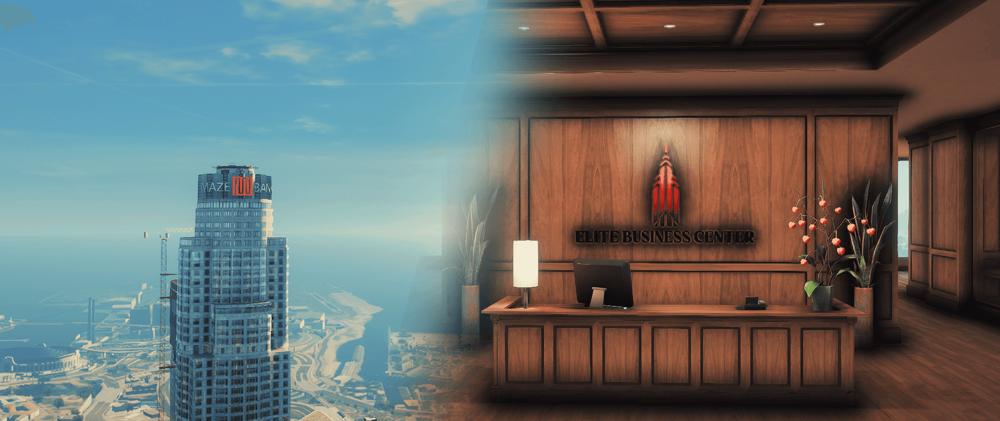

### DESPRE NOI

ELITE BUSINESS CENTER nu este doar un nume, ci un partener de încredere dedicat să ofere clienților săi un mediu propice pentru dezvoltare și succes. Rețeaua noastră de afaceri, situată în regiunea Los Santos, este concepută pentru a crea un echilibru între afaceri și stilul de viață. Locația noastră strategică, în zone cu proiecte mixte, garantează acces facil și condiții optime pentru creștere și evoluție profesională.

### CLAUZE CONTRACTUALE GENERALE ȘI OBLIGATORII
- Chiria aferentă locației alese trebuie achitată zilnic, timp de 30 de zile consecutive de la momentul semnării contractului. După achitarea integrală a sumei, ELITE BUSINESS CENTER va oferi spațiul închiriat fără alte costuri suplimentare pentru toată perioada derulării afacerii.
- IMPORTANT: În cazul în care plata nu este efectuată timp de 3 zile consecutive, contractul va fi anulat automat, iar sumele deja achitate nu vor fi returnate.
- Chiria nu poate fi achitată în avans pentru întreaga perioadă de 30 de zile. Este obligatoriu ca fiecare chiriaș să efectueze plata zilnic pentru spațiul închiriat. În cazul unei absențe de două zile consecutive, se va emite un avertisment.
- ATENȚIE: Acumularea a 4 avertismente atrage după sine rezilierea contractului, fără posibilitatea recuperării sumelor achitate.
- Subînchirierea sau vânzarea dreptului de utilizare a locației închiriate este strict interzisă. Dacă nu mai doriți să folosiți spațiul, rezilierea contractului trebuie realizată la sediul ELITE BUSINESS CENTER.
- Este interzisă desfășurarea unor activități care nu corespund destinației stabilite pentru spațiul respectiv. De exemplu, nu este permisă prestarea serviciilor de frizerie într-un salon de tatuaje.
- Orice modificare a spațiului închiriat trebuie aprobată în prealabil de ELITE BUSINESS CENTER.
- Chiriașul este responsabil pentru menținerea curățeniei și integrității spațiului închiriat.
- Orice activitate ilegală desfășurată în incinta business-ului duce la anularea imediată a contractului și posibile sancțiuni suplimentare.
- Reclamațiile clienților față de serviciile oferite pot duce la verificări și sancțiuni aplicate business-ului închiriat.
- Chiriașul este responsabil pentru respectarea normelor de siguranță impuse de ELITE BUSINESS CENTER.
- Orice deteriorare a spațiului închiriat va fi suportată financiar de către chiriaș.
- Este interzisă folosirea spațiului în scopuri personale sau neautorizate.
- În cazul unor dispute sau conflicte cu alți chiriași, acestea trebuie raportate imediat la ELITE BUSINESS CENTER.
- Orice tentativă de fraudă sau evitare a obligațiilor contractuale atrage rezilierea imediată a contractului.
- ATENȚIE: Orice abatere de la destinația stabilită a spațiului va duce la rezilierea contractului.
- În cazul în care angajații sau administratorii unui business creează probleme clienților, se pot aplica sancțiuni variind de la un simplu avertisment până la anularea contractului de închiriere.

ELITE BUSINESS CENTER își rezervă dreptul de a modifica regulile contractuale, cu notificarea prealabilă a chiriașilor.

### CONTACT 
- Localitate: Los Santos
- Zona: Downtown
- Strada: San Andreas Avenue
- Harta: [CLICK AICI](https://imgur.com/CZIszrt)
- Telefon: [0734784683]

### PROGRAM
- Luni: 19:00 - 21:00
- Marti: INCHIS
- Miercuri: 19:00 - 21:00
- Joi: INCHIS
- Vineri: 19:00 - 21:00
- Sambata: INCHIS
- Duminica: INCHIS
