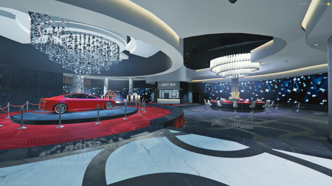
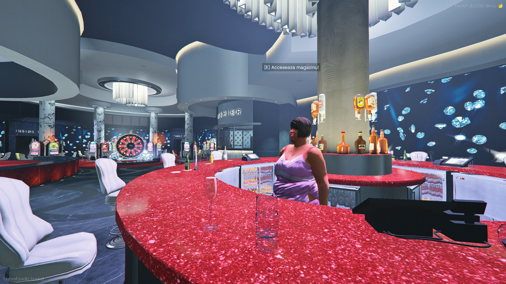

<!-- Logo sus -->

<h1 class="eg-casino-main-title">Despre Casino</h1>

<!-- Card 1 -->
<section class="eg-casino-card">
  <h2 class="eg-casino-card-title">Ce este Casino-ul?</h2>
  

    Casino-ul este locul unde jucătorii pot încerca să-și mărească averea sau, din contră, să piardă totul. Este un spațiu dedicat celor pasionați de jocurile de noroc și distracție, aducând un plus de adrenalină în viața de zi cu zi a orașului.
  

  <ul class="eg-casino-list">
    <li>Jocuri de noroc variate: ruletă și slot machines.</li>
    <li>Atenție la riscurile pierderilor financiare semnificative.</li>
    <li>Loc ideal pentru socializare și momente pline de suspans.</li>
  </ul>
</section>

<!-- Card 2 -->
<section class="eg-casino-card">
  <h2 class="eg-casino-card-title">Interiorul din casino</h2>
  
</section>

<!-- Card 3 -->
<section class="eg-casino-card">
  <h2 class="eg-casino-card-title">Magazin pentru băuturi și mâncare</h2>
  
</section>

<!-- Card 4 -->
<section class="eg-casino-card">
  <h2 class="eg-casino-card-title">De unde cumperi chips-uri?</h2>
  
Chips-urile se cumpără de la cashier, așa cum se vede și în gif-ul de mai jos:

  
</section>

<!-- Card 5 -->
<section class="eg-casino-card">
  <h2 class="eg-casino-card-title">Lucky Wheel</h2>
  

    Principala atracție este roata norocului, unde poți consuma bani pentru a câștiga o mașină exclusivă. Șansele sunt mici, dar merită încercat de mai multe ori!
  

  
</section>

<!-- Card 6 -->
<section class="eg-casino-card">
  <h2 class="eg-casino-card-title">Pacanele (Slots)</h2>
  

    Sistemul de pacanele a fost refacut complet cu o interfata atractiva si moderna. Este bazat pe un joc clasic cu o singura linie unde trebuie sa nimeresti 3 obiecte de acelasi fel pentru a castiga.
  

  <ul class="eg-casino-list">
    <li>Miza configurabila - alegi cat vrei sa pariezi</li>
    <li>Auto-spin - poti juca automat pana la 500 de jocuri consecutive</li>
    <li>Animatie de castig speciala pentru premiile mari</li>
    <li>Apasa SPACE pentru a invarte sau activeaza auto-spin</li>
  </ul>
  
</section>

<!-- Card 7 -->
<section class="eg-casino-card">
  <h2 class="eg-casino-card-title">Coinflip</h2>
  

    Jocul Coinflip este simplu: alegi intre cap sau pajura cu o sansa de 50-50. Este un mod rapid de a-ti testa norocul!
  

  <ul class="eg-casino-list">
    <li>Pariuri intre 100 si 10.000 de euro</li>
    <li>Sansa de 50-50 - alegi cap sau pajura</li>
    <li>In stanga ecranului vezi statistica intregii sesiuni</li>
    <li>In dreapta selectezi miza si apesi butonul de incepere</li>
  </ul>
</section>
