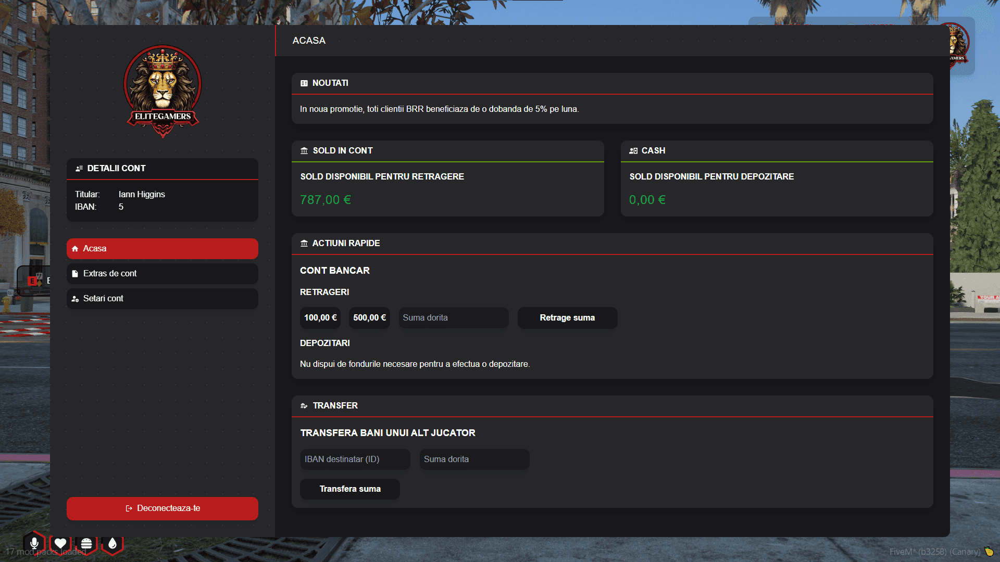

###  Gestionarea banilor tăi nu a fost niciodată mai simplă! 

Accesează ATM-urile din oraș pentru a retrage, depune sau verifica soldul contului tău bancar. Fie că ai nevoie de bani lichizi pentru cumpărături sau vrei să îți păstrezi economiile în siguranță, ATM-urile sunt mereu la dispoziția ta! 

 Atenție! Retragerea unor sume mari poate atrage priviri nedorite. Asigură-te că ești într-un loc sigur înainte de a scoate banii!
 Găsește un ATM și gestionează-ți finanțele cu grijă! 

###  Funcționalități 

🔹 Retragere de numerar – Ai nevoie de bani lichizi? Introdu suma dorită și scoate rapid banii din cont. Dar ai grijă unde și când retragi! 

🔹 Depunere de bani – Ține-ți economiile în siguranță! Depune banii direct în contul tău bancar și protejează-te de hoți. 

🔹 Verificarea soldului – Vrei să știi câți bani mai ai în cont? Un simplu acces la ATM îți afișează instant soldul disponibil. 

🔹 Transfer de bani – Trimite rapid bani altor jucători folosind IBAN-ul lor. Perfect pentru afaceri, datorii sau ajutor între prieteni!

Fii inteligent cu banii tăi și folosește ATM-urile pentru o gestionare rapidă și sigură a finanțelor! 

