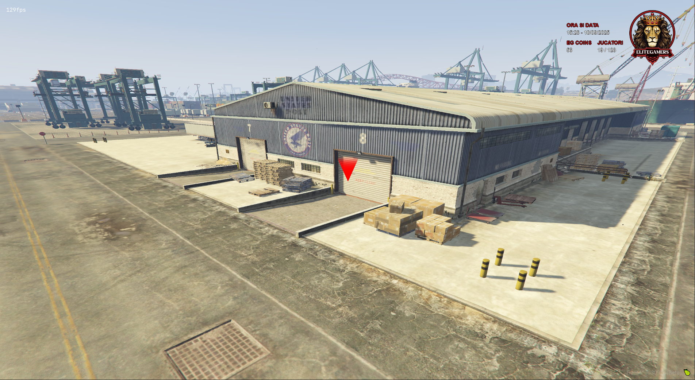

### 
 Depozite Los Santos 

In orasul Los Santos avem 3 depozite in care puteti stoca diferite iteme personale la care doar voi aveti acces platind o taxa de utilizare.
### 
  Depozit Vespucci 

:::tip Informatii:
- Costul utilizarii depozitului este de 1.000 euro per utilizare
- Capacitatea de stocare este de 2.000kg
:::

### 
  Depozit Portul Vechi 

:::tip Informatii:
- Costul utilizarii depozitului este de 2.000 euro per utilizare
- Capacitatea de stocare este de 2.000kg
:::

### 
  Depozit Mesa 

:::tip Informatii:
- Costul utilizarii depozitului este de 1.000 euro per utilizare
- Capacitatea de stocare este de 2.000kg
:::