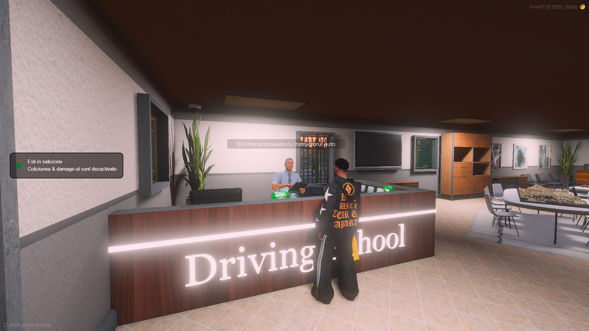
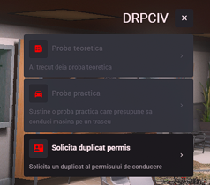

### 
 Driving School by eliteGamers

  <strong style="color: #008000;">🚗 Școala de Șoferi:</strong> Localizată la codul poștal <strong>836</strong>, marcată pe hartă cu un <strong>blip verde (mașină)</strong>.
  <ul>
    <li>Aici poți obține permisul de conducere după susținerea probelor teoretice și practice.</li>
    <li>Instructorii sunt pregătiți să te ajute să înveți regulile și să conduci corect.</li>
    <li>📍 Punct de reper ușor de găsit pe hartă, ideal pentru toți cetățenii noi.</li>
  </ul>

### 
1. Prezentare 

    

### 
2. Cum dai de permis? 

  <strong style="color: #008000;">📋 DRPCIV - Școala de Șoferi:</strong> 
  La DRPCIV poți susține examenele necesare pentru obținerea permisului de conducere.
  <ul>
    <li>📘 <strong>Proba teoretică:</strong> Test cu întrebări despre regulile de circulație.</li>
    <li>🚗 <strong>Proba practică:</strong> Conduci o mașină pe traseu pentru a demonstra abilitățile.</li>
    <li>📝 <strong>Solicitare duplicat:</strong> Poți cere un duplicat al permisului de conducere.</li>
  </ul>

