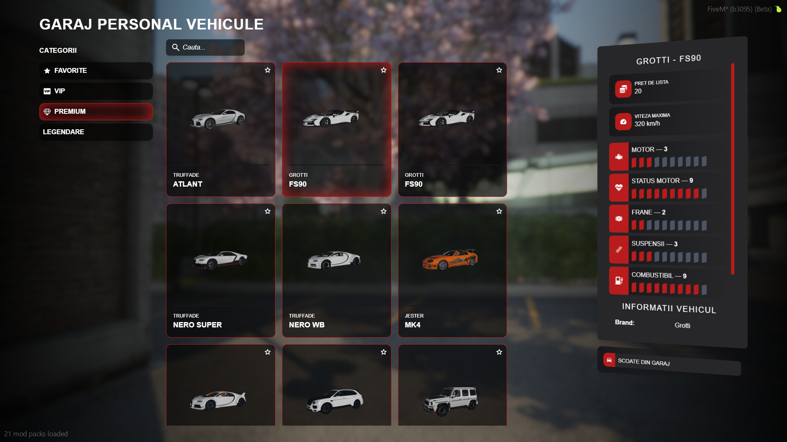

  <h1> Garaje Personale </h1>

  

    Acest script aduce un sistem modern de garaj pentru serverul nostru de FiveM, cu un design curat si usor de folosit.  
    Jucatorii isi pot administra vehiculele personale direct dintr-un meniu intuitiv.
    

    
### 
1. Prezentare 

    

### 
2. Detalii Importante 

  

    <ul>
      <li><b>Categorii personalizate</b> – Vehiculele pot fi sortate pe categorii precum Favorite, VIP, Premium sau Legendare.</li>
      <li><b>Sistem de cautare</b> – Bara de cautare permite gasirea rapida a oricarui vehicul din garaj.</li>
      <li><b>Informatii detaliate despre vehicul</b> – Statistici precum:
        <ul>
          <li>Pret de lista</li>
          <li>Viteza maxima</li>
          <li>Nivel motor</li>
          <li>Status motor</li>
          <li>Frane</li>
          <li>Suspensii</li>
          <li>Combustibil</li>
        </ul>
      </li>
      <li><b>Optiuni rapide</b> – Jucatorii pot scoate masinile din garaj cu un singur click.</li>
    </ul>
  

### 
3. Sistem Sloturi Garaj 

  

    <ul>
      <li><b>Limita Default</b> - Toti jucatorii au 12 sloturi in garaj care includ toate vehiculele personale (masini, motociclete, avioane, barci, elicoptere)</li>
      <li><b>Sloturi Aditionale</b> - Poti cumpara sloturi extra din /store</li>
      <li><b>Vehicule VIP</b> - Vehiculele VIP NU se numara la sloturi, ai loc nelimitat pentru ele</li>
      <li><b>Depasire Limita</b> - Daca ai mai multe vehicule decat sloturi, nu poti cumpara vehicule noi pana nu vinzi din cele existente</li>
      <li><b>Sfat</b> - Vinde masinile nefolosite la remat sau targ auto pentru a elibera sloturi</li>
    </ul>
  

### 
4. Stare Piese Vehicul 

  

    <ul>
      <li><b>Afisare Piese</b> - Interfata arata starea pieselor principale si consumabile ale fiecarui vehicul</li>
      <li><b>Tuning Custom</b> - Vezi detalii despre engine swap, turbina si stancing aplicat</li>
      <li><b>Istoric Service</b> - Poti vedea istoricul de interventii al vehiculului</li>
    </ul>
  

### 
5. Mentiuni 

  

    <ul>
      <li>Interfata moderna si responsive cu tema noua</li>
      <li>Usor de configurat si integrat</li>
      <li>Experienta realista pentru jucatori</li>
      <li>Acces si din aplicatia Garaj de pe telefon</li>
    </ul>
  

