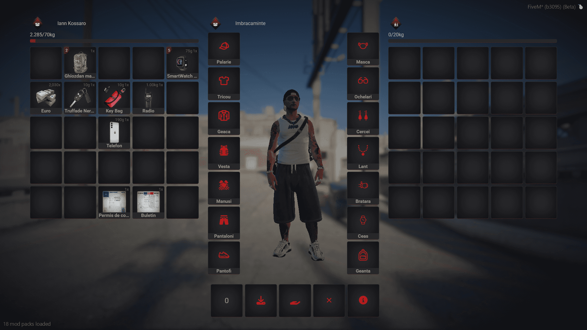

#  
Utilizarea Inventarului 

## Sistem de Inventar - EliteGamers RP 
 Control total asupra echipamentului tău!
- Într-o lume în care fiecare secundă contează, ai nevoie de un inventar care să îți ofere acces rapid, organizare eficientă și un stil modern. Sistemul de inventar din EliteGamers RP este conceput pentru a-ți îmbunătăți experiența și a face gestionarea obiectelor mai intuitivă și realistă.

## Ce face acest inventar special?
- Design modern și intuitiv – O interfață elegantă, bine organizată, cu un aspect curat și ușor de utilizat.
- Greutate realistă – Fiecare obiect are o greutate specifică, astfel încât să nu poți transporta un depozit întreg asupra ta. Organizarea devine cheia succesului!
- Acces rapid la obiecte esențiale – Arme, echipamente, documente, droguri și alte obiecte pot fi utilizate instant prin sloturile de acces rapid.
- Gestionare avansată a containerelor – Posibilitatea de a depozita obiecte în ghiozdane, depozite sau chiar în portbagajul mașinii!
- Interacțiune cu obiectele – Poți folosi, arunca, foloseste sau ofera fiecare obiect în parte.
- Obiecte de valoare – Permise de conducere, telefoane și alte obiecte esențiale.
- Siguranță și realism – Nu mai poți transporta o sumedenie de arme și obiecte fără consecințe. Totul trebuie gestionat cu grijă!

## Cum îți îmbunătățește experiența?
- Pentru gangsteri: Poți ascunde obiectele interzise în ghiozdane sau alte depozite, dar ai grijă! Poliția poate descoperi totul.
- Pentru polițiști: O interfață mai clară pentru percheziții, identificarea rapidă a obiectelor suspecte și gestionarea probelor.
- Pentru afaceriști: Gestionarea documentelor, banilor și obiectelor de valoare devine mai ușoară ca niciodată.
- Pentru toți jucătorii: Mai puțin haos, mai multă organizare și un sistem care îți permite să joci mai realist.

 Administrează-ți resursele, planifică-ți mișcările și domină orașul cu stil! 

