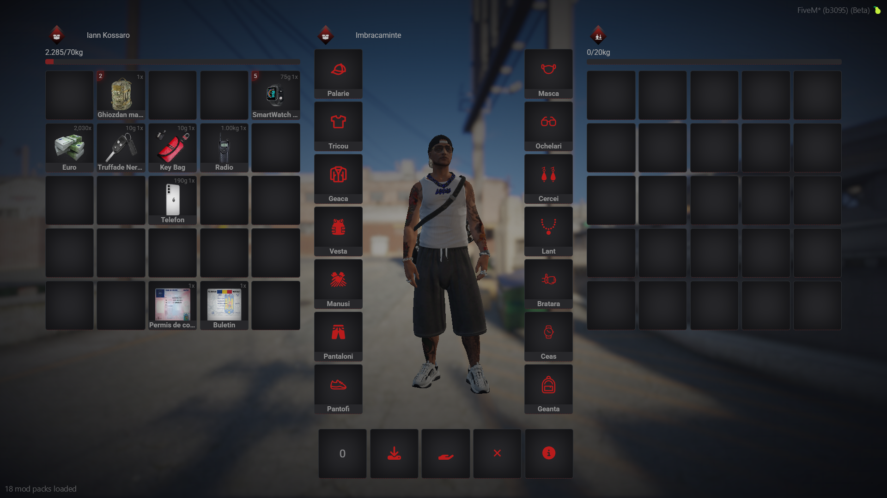

  <h1>Utilizarea Inventarului</h1>

  <h3 style="color: #cc0000;">Sistem de Inventar - EliteGamers RP</h3>
  
<strong>Control total asupra echipamentului tău!</strong>

  

    Într-o lume în care fiecare secundă contează, ai nevoie de un inventar care să îți ofere acces rapid, organizare eficientă și un stil modern.  
    Sistemul de inventar din <strong>EliteGamers RP</strong> este conceput pentru a-ți îmbunătăți experiența și a face gestionarea obiectelor mai intuitivă și realistă.
  

  

  <h3>Ce face acest inventar special?</h3>
  <ul style="list-style-type: disc;">
    <li><strong>Design modern și intuitiv</strong> – O interfață elegantă, bine organizată, cu un aspect curat și ușor de utilizat.</li>
    <li><strong>Greutate realistă</strong> – Fiecare obiect are o greutate specifică, astfel încât să nu poți transporta un depozit întreg asupra ta. Organizarea devine cheia succesului!</li>
    <li><strong>Acces rapid la obiecte esențiale</strong> – Arme, echipamente, documente, droguri și alte obiecte pot fi utilizate instant prin sloturile de acces rapid.</li>
    <li><strong>Gestionare avansată a containerelor</strong> – Posibilitatea de a depozita obiecte în ghiozdane, depozite sau chiar în portbagajul mașinii!</li>
    <li><strong>Interacțiune cu obiectele</strong> – Poți folosi, arunca, oferă sau utiliza fiecare obiect în parte.</li>
    <li><strong>Obiecte de valoare</strong> – Permise de conducere, telefoane și alte obiecte esențiale.</li>
    <li><strong>Siguranță și realism</strong> – Nu mai poți transporta o sumedenie de arme și obiecte fără consecințe. Totul trebuie gestionat cu grijă!</li>
  </ul>

  <h3>Cum îți îmbunătățește experiența?</h3>
  <ul style="list-style-type: square;">
    <li><strong>Pentru gangsteri:</strong> Poți ascunde obiectele interzise în ghiozdane sau alte depozite, dar ai grijă! Poliția poate descoperi totul.</li>
    <li><strong>Pentru polițiști:</strong> O interfață mai clară pentru percheziții, identificarea rapidă a obiectelor suspecte și gestionarea probelor.</li>
    <li><strong>Pentru afaceriști:</strong> Gestionarea documentelor, banilor și obiectelor de valoare devine mai ușoară ca niciodată.</li>
    <li><strong>Pentru toți jucătorii:</strong> Mai puțin haos, mai multă organizare și un sistem care îți permite să joci mai realist.</li>
  </ul>

  

    Administrează-ți resursele, planifică-ți mișcările și domină orașul cu stil!
  

