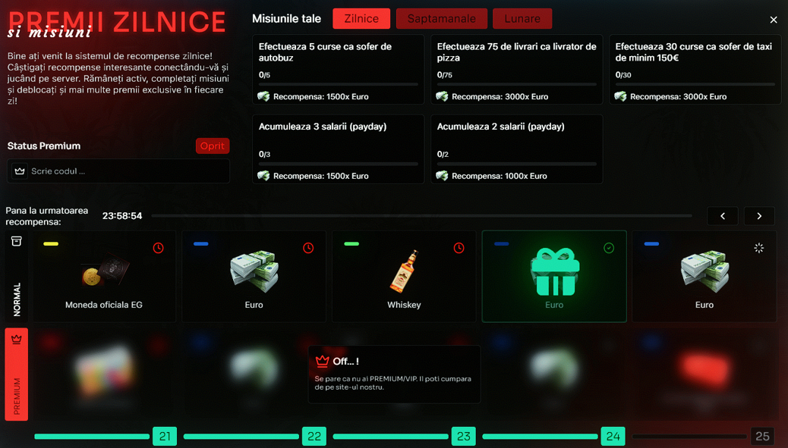

    

## Premii zilnice prin activitate

  <strong>🔥 Daily Rewards / Premii Zilnice</strong> este un sistem avansat de recompense bazat pe misiuni zilnice, săptămânale și lunare, conceput pentru a încuraja activitatea constantă a jucătorilor pe server.

### ⚡ Caracteristici principale

  <ul>
    <li>Misiuni zilnice, săptămânale și lunare – Jucătorii au obiective variate, de exemplu:
      <ul>
        <li>🚗 Efectuarea unui număr de curse ca șofer</li>
        <li>🍕 Realizarea livrărilor ca livrator de pizza</li>
        <li>💰 Acumularea de salarii (payday)</li>
      </ul>
    </li>
  </ul>

### 🎯 Alte caracteristici

  <ul>
    <li> Recompense atractive – bani, iteme rare (whiskey, eg-coins, cadouri), șanse la premii mari.</li>
    <li> Status Premium/VIP – oferă acces la recompense exclusive și mai valoroase.</li>
    <li> Timer zilnic – cronometru vizibil pentru următoarea recompensă.</li>
    <li> Interfață intuitivă – UI modern și clar, organizat pe categorii.</li>
  </ul>

### 📜 Comenzile disponibile

  <ul>
    <li><strong>/premii</strong> – Afișează lista recompenselor și timpul rămas.</li>
    <li><strong>/misiuni</strong> – Vezi progresul misiunilor și recompensele aferente.</li>
  </ul>

