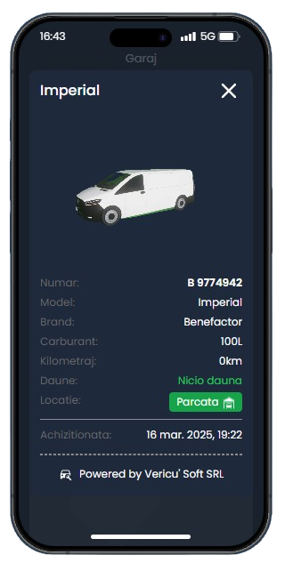
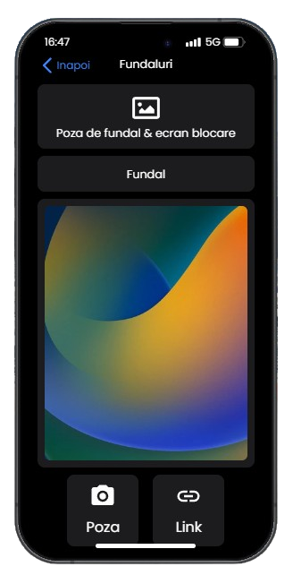
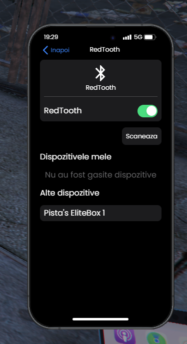

    

# 
 Utilizarea Telefonului pe EliteGamers RP

  <strong style="color: #d72638;">Sfat:</strong> Telefonul este o componentă esențială a roleplay-ului. Fii atent la apeluri, mesaje și folosește-l pentru a rămâne conectat cu lumea din joc!

---
##  Informatii

  <ul style="color: #fff; line-height: 1.7;">
    <li>Acest telefon virtual redefinește modul în care interacționezi cu lumea digitală, oferind un echilibru perfect între eleganță și funcționalitate. Cu un design modern, inspirat de tehnologiile de ultimă generație, dispozitivul îți pune la îndemână toate instrumentele necesare pentru comunicare, organizare și divertisment.</li>
    <li>Interfața sa intuitivă îți permite să navighezi fără efort între aplicații, fiecare fiind creată pentru a oferi o experiență fluidă și captivantă. Indiferent dacă îți gestionezi contactele, explorezi hărți sau accesezi servicii esențiale, fiecare detaliu este gândit pentru a-ți oferi eficiență și confort.</li>
    <li>Acest telefon nu este doar un simplu dispozitiv digital, ci un companion inteligent, pregătit să îți simplifice viața și să îți ofere o conexiune rapidă și sigură oriunde te-ai afla.</li>
  </ul>

## Interfață și Navigare

  <ul style="color: #fff; line-height: 1.7;">
    <li>Acces rapid la aplicații precum: <strong>Mesaje</strong>, <strong>Apeluri</strong>, <strong>Twitter</strong>, <strong>Galerie</strong> și altele.</li>
    <li>Design curat, intuitiv, inspirat din iOS.</li>
    <li>Posibilitate de personalizare: schimbă tema, imaginea de fundal și sunetul notificărilor.</li>
  </ul>

---

## Aplicații disponibile

  

    <h3 style="margin-top: 0; color: #d72638;"> Apeluri, Mesaje & Contacte</h3>
    
Sună alți jucători, trimite mesaje rapide și salvează contacte importante.

  

  

    <h3 style="margin-top: 0; color: #d72638;"> Loops & Emails</h3>
    
Comunică public cu toți cetățenii prin rețeaua socială locală.

  

  

    <h3 style="margin-top: 0; color: #d72638;"> GPS & Hartă</h3>
    
Navighează rapid prin oraș folosind GPS-ul integrat din telefon.

  

  

    <h3 style="margin-top: 0; color: #d72638;"> Cameră & Galerie</h3>
    
Fă poze memorabile și accesează-le ulterior în aplicația Galerie.

  

  

    <h3 style="margin-top: 0; color: #d72638;"> Garaj</h3>
    
Vizualizeaza live pe server direct din telefon ce masini ai in garaj.

  

  

    <h3 style="margin-top: 0; color: #d72638;"> Servicii</h3>
    
In caz de urgente, poti sa suni la politie, smir sau mecanici.

  

  

    <h3 style="margin-top: 0; color: #d72638;"> InetMax</h3>
    
Fiecare aplicatie consuma un minim de GB, fapt pentru care trebuie sa verifici mereu cat internet ai.

  
  

    

    <h3 style="margin-top: 0; color: #d72638;"> Setari</h3>
    
Fiecare aplicatie consuma un minim de GB, fapt pentru care trebuie sa verifici mereu cat internet ai.

  

      

    <h3 style="margin-top: 0; color: #d72638;"> Youtube & ELITEBOX </h3>
    
Ai posibilitatea de a asculta ce melodie vrei direct de pe telefon + pe boxa ELTIEBOX.

  

---

###  Contacte – Gestionarea listei de contacte, apeluri și mesaje
Aplicația Contacte este centrul de gestionare a conexiunilor tale. Aceasta îți permite să îți organizezi lista de contacte într-un mod eficient, oferindu-ți acces rapid la persoanele cu care comunici frecvent.

- Adăugarea și organizarea contactelor – Poți salva noi contacte cu nume, numere de telefon și alte informații relevante. De asemenea, ai posibilitatea de a edita sau șterge contacte oricând dorești.
- Inițierea rapidă a apelurilor – Printr-o simplă atingere, poți apela oricare dintre contactele salvate, fără a fi nevoie să tastezi manual numărul de telefon.
- Trimiterea de mesaje – Aplicația îți oferă acces direct la funcția de mesagerie, astfel încât să poți trimite rapid un SMS către orice contact din listă.
- Căutare rapidă – Dacă ai o listă extinsă de contacte, funcția de căutare îți permite să găsești instant persoana dorită tastând doar câteva litere din numele acesteia.
- Istoric de interacțiuni – Aplicația păstrează un istoric al apelurilor efectuate, primite sau ratate, oferindu-ți o evidență clară a comunicării cu fiecare contact.

###  Email – Primirea mesajelor electronice
Aplicația Email este destinată exclusiv primirii mesajelor electronice, oferindu-ți acces rapid și organizat la toate comunicările importante. Indiferent dacă primești notificări oficiale, mesaje administrative sau emailuri personale, această aplicație îți permite să le gestionezi eficient, asigurându-te că nu ratezi nicio informație esențială.

 Primirea emailurilor – Toate mesajele trimise către adresa ta sunt livrate instantaneu, permițându-ți să fii mereu la curent cu informațiile primite. Notificările în timp real îți asigură acces imediat la cele mai recente emailuri.

 Organizarea automată a mesajelor – Emailurile sunt afișate într-o interfață clară, aranjate în ordine cronologică pentru a facilita navigarea și identificarea celor mai recente comunicări.

 Căutare avansată – Dacă ai un număr mare de mesaje, funcția de căutare îți permite să găsești rapid un email specific, folosind cuvinte-cheie, expeditorul sau data primirii.

 Mesaje administrative și notificări importante – Pe lângă emailurile obișnuite, aplicația îți oferă acces la notificări esențiale despre diverse evenimente sau schimbări relevante pentru tine.

### Anunțuri – Panou informativ pentru mesaje publice și administrative
Aplicația Anunțuri este locul unde utilizatorii pot vizualiza cele mai recente mesaje publice și administrative esențiale. Fii la curent cu informațiile importante care te pot afecta, de la anunțuri guvernamentale până la notificări locale.

- Vizualizare anunțuri recente – Poți accesa cele mai noi anunțuri publicate de autorități sau organizații. Acestea sunt afișate într-un format ușor de citit și structurat pe categorii.
- Căutare rapidă – Dacă vrei să găsești un anunț mai vechi, aplicația include o funcție de căutare prin cuvinte cheie, care îți permite să găsești rapid informațiile de care ai nevoie.
- Categorii de anunțuri – Anunțurile sunt împărțite pe categorii (de exemplu, urgențe, actualizări locale, evenimente importante), facilitând accesul rapid la tipul de informație dorit.
- Notificări push – Poți activa notificări pentru a fi informat imediat ce sunt postate anunțuri importante sau urgente.
- Istoric anunțuri – Aplicația păstrează un istoric al anunțurilor vizualizate, astfel încât să poți reveni la orice informație importantă oricând.

### Servicii – Acces rapid la diferite servicii disponibile
- Aplicația Servicii îți permite să contactezi rapid cele mai importante servicii de care ai nevoie, direct printr-un apel telefonic. 
- Fie că este vorba de o problemă mecanică, o urgență polițienească, necesitatea unui taxi sau apelarea unui serviciu medical de urgență, aplicația te conectează instantaneu cu profesioniștii.

1. Apel rapid către Mecanici
- Contact direct cu mecanicii
- Aplicația îți permite să suni direct la cei mai apropiați mecanici pentru reparații auto urgente sau pentru asistență tehnică.
2. Apel rapid către Poliție
- Contact direct cu poliția
- În caz de urgență sau pentru a solicita ajutor, poți suna rapid la numărul de urgență al poliției, fiind conectat direct cu autoritățile.
3. Apel rapid către Taxi
- Comandă rapidă taxi
- Poți apela rapid un taxi, conectându-te direct cu serviciile de transport pentru o călătorie rapidă.
4. Apel rapid către SMIR (Serviciul Medical de Urgență)
- Contact direct cu SMIR
- În caz de urgență medicală, poți suna imediat la serviciile SMIR pentru a solicita intervenție rapidă.

### Garaj – Administrarea vehiculelor personale
Aplicația Garaj este ideală pentru gestionarea vehiculelor tale, de la urmărirea stării acestora, până la localizarea și administrarea parcării.

    
    

- Starea vehiculelor = Poți vizualiza informații detaliate despre starea fiecărui vehicul, inclusiv kilometrajul, nivelul de combustibil, întreținerea necesară și altele.
- Data achizitionarii = Permite vizualizarea datei in care a fost achizitionat autovehiculul.
- Date suplimentare = Se precizeaza brand-ul, modelul, si numarul.

### Banking – Gestionarea finanțelor personale
Aplicația Banking îți permite să îți administrezi toate tranzacțiile financiare într-un loc sigur și ușor de accesat.

- Verificarea soldului – Poți verifica soldul contului tău bancar în timp real, indiferent unde te afli.
- Transferuri rapide – Realizează transferuri bancare rapide și sigure între conturi, atât interne, cât și internaționale.
- Plăți online – Efectuează plăți rapide pentru facturi, cumpărături sau servicii, fără a ieși din aplicație.
- Istoric tranzacții – Vizualizează toate tranzacțiile anterioare și primește notificări despre mișcările contului tău.

### Loops – Platformă socială pentru activități și colecția de mașini
Aplicația Loops este un spațiu social dedicat pasionaților de mașini și activități de orice fel. Aici poți interacționa cu prieteni, posta imagini și împărtăși momente din viața ta.

    
    

- Postarea de imagini – Poți posta imagini cu activitățile tale sau colecția de mașini, pentru a le împărtăși cu alți utilizatori.
- Interacțiune socială – Urmărește utilizatori, dă like-uri și lasă comentarii la postările altora pentru a rămâne conectat cu rețeaua ta socială.
- Crearea unui profil personalizat – Îți poți personaliza profilul cu informații despre tine, pasiunile tale și colecția de mașini.
- Căutare și descoperire – Căută activități, evenimente sau utilizatori cu interese similare pentru a-ți extinde rețeaua socială.
- Galerie personală – Ține toate postările și imagini într-o galerie personală pe care o poți organiza și partaja oricând.

### Galerie – Organizarea și vizualizarea imaginilor
Aplicația Galerie îți permite să stochezi, organizezi și vizualizezi rapid toate fișierele media, inclusiv capturi de ecran și fotografii.

- Stocarea fișierelor media – Salvează și organizează toate fișierele tale media într-un singur loc, fie că sunt poze, capturi de ecran sau imagini din aplicații.
- Vizualizare rapidă – Accesează fișierele tale într-un mod rapid și eficient, având posibilitatea de a le vizualiza direct din aplicație.

### InetMax (5G) – Gestionarea conexiunii la internet
Aplicația InetMax te ajută să gestionezi conexiunea la internet și să achiziționezi pachete de date pentru a rămâne conectat în orice moment.

Verificarea stării rețelei – Poți verifica rapid starea conexiunii tale la rețea.
Achiziționarea pachetelor de internet – Achiziționează rapid pachete de date suplimentare pentru a te asigura că ai suficient internet.
Monitorizarea consumului de date – Urmărește consumul de date pentru a evita depășirea limitelor impuse de operatorul tău.
Notificări de conectivitate – Primești notificări atunci când conexiunea la rețea este slabă sau întreruptă.

### GPS – Navigație și găsirea locațiilor
Aplicația GPS îți oferă indicații precise pentru a ajunge la destinațiile dorite, indiferent de locația ta.

Indicații de navigație – Primești direcții pas cu pas pentru a ajunge rapid și ușor la destinațiile tale.
Găsirea locațiilor dorite – Căutând o adresă sau un loc pe hartă, aplicația îți arată rutele optime și alternative.

### Apeluri – Inițiază și primește apeluri, gestionează agenda telefonică
Aplicația Apeluri este esențială pentru comunicarea zilnică. Aceasta îți permite să efectuezi apeluri telefonice rapid și eficient, să primești apeluri și să îți gestionezi întreaga agenda telefonică.

    
    

1. Inițiere apeluri
- Poți efectua apeluri către orice număr din lista de contacte sau prin tastarea unui număr de telefon. Aplicația îți oferă o interfață intuitivă pentru a apela rapid pe cine dorești.

2. Primirea apelurilor
- Poți răspunde rapid la apelurile primite cu o simplă atingere a ecranului, fără a fi nevoie să navighezi prin diverse meniuri.

3. Gestionarea agendei telefonice
- Aplicația îți permite să adaugi, să editezi sau să ștergi contacte din lista ta, astfel încât să poți organiza rapid informațiile de contact.

4. Istoric apeluri
- Aplicația păstrează un istoric detaliat al apelurilor efectuate și primite, permițându-ți să vizualizezi informațiile legate de fiecare apel (data, durata, tipul apelului).

### Mesagerie – Trimiterea și primirea de SMS-uri
Aplicația Mesagerie îți oferă posibilitatea de a trimite și de a primi mesaje text (SMS) într-un mod simplu și eficient, fiind un instrument esențial pentru comunicarea rapidă.

1. Trimiterea de SMS-uri
- Poți trimite mesaje text către orice contact din lista ta de contacte sau la numere de telefon necunoscute. Aplicația îți permite să compui mesaje rapid, folosind tastatura telefonului.

2. Primirea SMS-uri
- Aplicația notifică instant când primești un mesaj nou, iar interfața este ușor de utilizat pentru a citi și a răspunde rapid.

3. Mesaje grupuri
- Poți crea grupuri de contacte și trimite mesaje simultan mai multor persoane, economisind timp atunci când vrei să comunici cu mai mulți oameni.

4. Permite Share Location
- Aplicatia "Mesagerie" permite si trimiterea share location-ului pentru a face viata mai usoara.

### Cameră foto – Capturarea de imagini și înregistrări video
Aplicația Cameră foto îți oferă toate instrumentele necesare pentru a captura imagini de înaltă calitate și înregistrări video, fie că vrei să imortalizezi un moment special sau să faci fotografii pentru diverse nevoi.

1. Capturarea de imagini
- Aplicația îți permite să faci fotografii rapide și clare. Poți ajusta setările camerei precum zoom din Mouse Wheel UP/Down.

### Setări – Configurarea telefonului și personalizarea funcțiilor
Aplicația Setări îți permite să personalizezi și să configurezi telefonul, oferindu-ți control asupra funcțiilor esențiale ale dispozitivului tău.

    

        
        
    

    

        
        
    

1.Personalizarea ecranului principal
- Poti personaliza atat avatar-ul cat si wallpaer ul prin link-uri URL.

2. Gestionarea conexiunilor
- Permite gestionarea conexiunilor wireless. De asemenea, poți activa sau dezactiva moduri precum „Avion” sau „Nu Deranja”.

### YouTube – Redare Audio în Joc
Aplicația YouTube îți oferă posibilitatea de a asculta muzica preferată direct în joc, fără redare video, astfel încât să te bucuri de un fundal sonor perfect pentru experiența ta de gaming.

    

        
        
    

    

        
    

### ELITEBOX - Boxa
Ai posibilitatea de a asculta cu prietenii tai cele mai top melodii de pe youtube pe boxa Elitebox
- Boxa se gaseste la orice DigitalDen, se pune pe jos iar apoi se conecteaza din Setari -> Redtooth

    

        
        
    

## Setări & Personalizare

  <ul style="line-height: 1.6;">
    <li>Setează tonuri de apel personalizate.</li>
    <li>Schimbă fundalul telefonului după preferințe.</li>
    <li>Alege tema: Dark sau Light.</li>
  </ul>

---

## Probleme si fix-uri

  <ul style="line-height: 1.6;">
    <li> Dacă telefonul nu se deschide, apasă din nou <strong style="color: #d72638;">M</strong> și așteaptă câteva secunde.</li>
    <li> Probleme cu semnalul? Verifică dacă ești într-o zonă aglomerată.</li>
    <li> Recomandare: folosește versiunea <code>BETA</code> pe FiveM dacă telefonul se blochează.</li>
  </ul>

---

## Concluzie

  

    Telefonul este esențial pentru orice jucător activ din oraș. Asigură-te că-l folosești responsabil și că rămâi conectat cu tot ce se întâmplă în EliteGamers RP!
  

