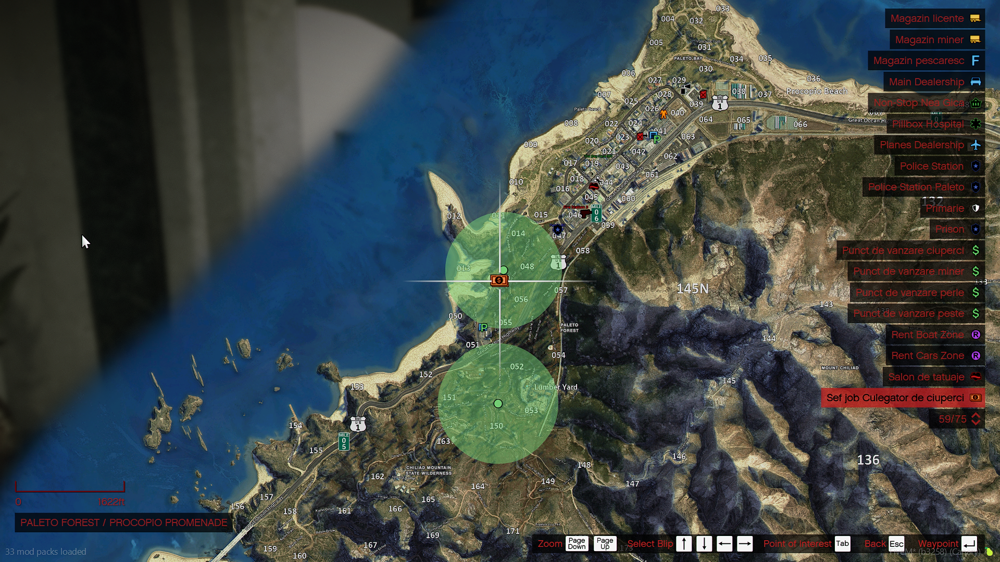
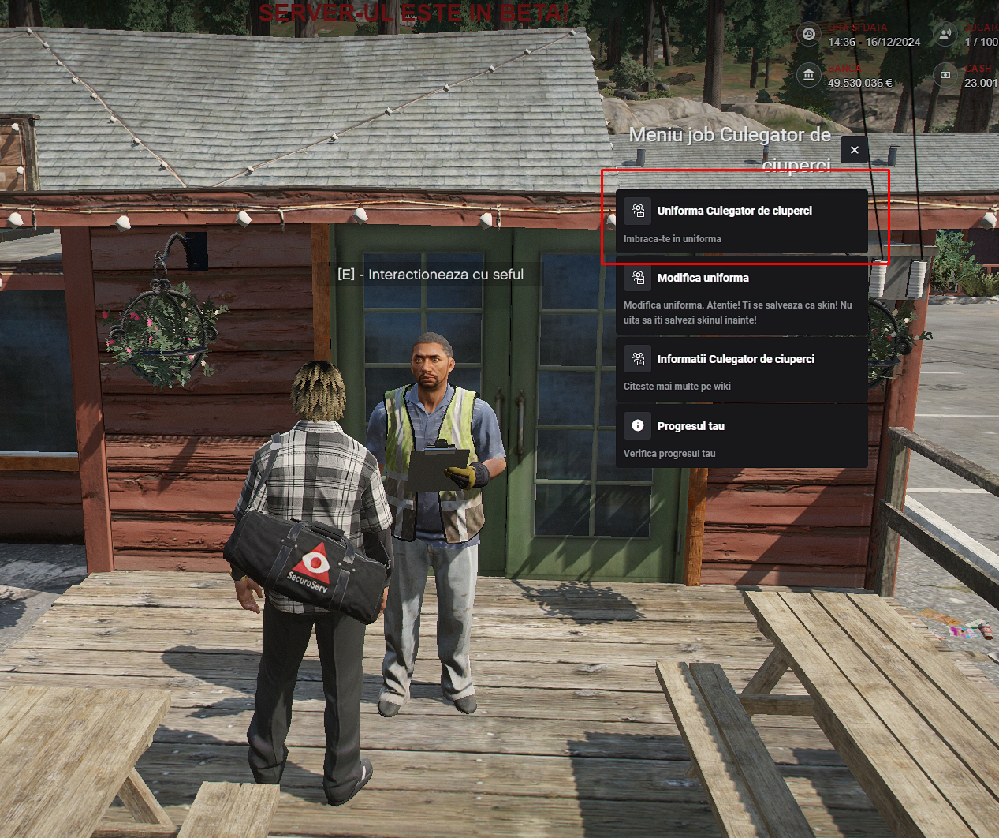

### Ce presupune acest job de ciupercar?

<eg-ciupercar-box>
  Jobul de ciupercar implică culesul ciupercilor dintr-o zonă prestabilită din apropierea Muntelui Chilliad pe partea orașului Paleto. La început vei culege aceste ciuperci pentru a urma să le vinzi la un NPC din mijlocul orașului (poză mai jos), dar dacă dorești să faci profit mai mult, după ce capeți o anumită experiență vei putea încerca și partea ilegală a acestui job ce presupune culegerea ciupercilor halucinogene și transformarea acestora în substanțe interzise.
</eg-ciupercar-box>

:::details Locatia Harta | Ciupercar
{.framed-photo}
:::

### Cum mă angajez?

<eg-ciupercar-box>
  Pentru a putea începe acest job trebuie să ai 10 ore jucate și să mergi la Primărie ([/gps - Primărie]), unde un NPC de la tejghea îți va permite să selectezi jobul de ciupercar. În cazul în care vrei să accesezi <b>Skill 2 - Culegător de Ciuperci Avansat</b>, ai nevoie de 50 ore.
</eg-ciupercar-box>

:::details Locatie Primarie
{.framed-photo}
:::

:::details NPC
{.framed-photo}
:::

### Prezentare job - Youtube

<iframe 
  width="560" 
  height="315" 
  src="https://www.youtube.com/embed/pERu399WS0M"
  title="YouTube video player" 
  frameborder="0" 
  allow="accelerometer; autoplay; clipboard-write; encrypted-media; gyroscope; picture-in-picture" 
  allowfullscreen
  style="display: block; margin: 0 auto 30px auto; border-radius: 5%; box-shadow: 0 1px 20px rgba(0, 0, 0, 0.7);">
</iframe>

### Informații suplimentare:

Skill-uri disponibile:

<eg-ciupercar-box>
  <ul style="line-height: 1.6; font-size: 1.1em; padding-left: 1.3em;">
    <li><b>Culegător de Ciuperci (Skill 1):</b> Implică culegerea de ciuperci normale, dar nici foarte scumpe.</li>
    <li><b>Culegător de Ciuperci Avansat (Skill 2):</b> Permite culegerea ciupercilor într-o zonă nouă unde poți găsi ciuperci mai scumpe, inclusiv ciuperci halucinogene care pot fi transformate în substanțe interzise ulterior.</li>
  </ul>
</eg-ciupercar-box>

<ul style="max-width: 700px; margin: 0 auto 40px auto; line-height: 1.6; font-size: 1.1em; padding-left: 1.3em;">
  <li>Vei avea nevoie de 10 ore pentru a putea practica acest job.</li>
  <li>Nu există restricții în legătură cu transportul folosit.</li>
  <li>Plata este în funcție de tipul de ciupercă vândută.</li>
  <li>Pentru a transforma ciupercile halucinogene trebuie să ajungi la ferma din Grapeseed.</li>
  <li>Vei fi obligat să folosești uniforma specifică pe care o poți primi de la NPC-ul Sef.</li>
</ul>

:::details Uniforma Ciupercar
{.framed-photo}
:::

