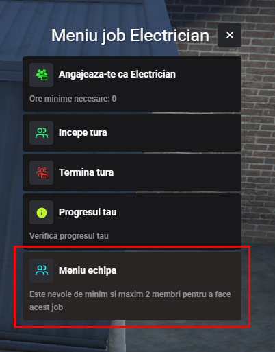
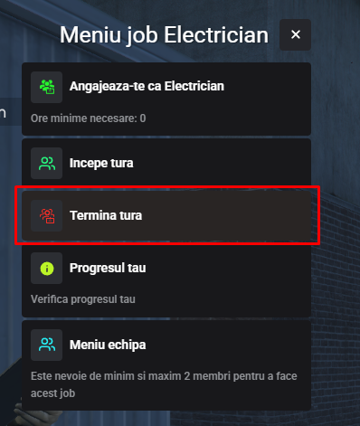

---

### Ce presupune Jobul de Electrician?

Jobul de electrician este o meserie practica si dinamica, ce poate fi practicata atat in echipa cat si individual. Odata ce incepeti tura, primiti o masina de serviciu si sunteti trimisi pe teren penteu a remedia probleme la stalpii retelei electrice din Los Santos. Impreuna cu colegul tau sau singur, vei urca pe stalpi, vei remedia defectiuni si vei contribui la buna functionare a orasului.

### Cum mă angajez?

<ul>
<li>Locatia prestabilita pentru angajare este la codul postal 592 unde veti intalni un NPC care va permite sa va angajati cu minimul de 0 ore.</li>
<li>Tot aici in aceasta locatie puteti discuta cu seful electrician pentru a va creea o echipa in care va puteti invita prietenii.</li>
</ul>

:::details Cod postal
{.framed-photo}
:::

:::details Punct Angajare
{.framed-photo}
:::

:::details Meniu Echipa
{.framed-photo}
:::

### Informatii utile

<ul>
<li>Odata stabilita locatia de lucru, marcata cu rosu pe GPS, trebuie sa ajungi la locul prestabilit si sa folosesti din masina scara. Aceasta se plaseaza langa stalpul problematic iar dupa ce te urci, vei avea de rezolvat un minigame care simbolizeaza remedierea problemei din retea.</li>
<li>Sa fii atent in timpul jobului sa nu uiti scara, altfel trebuie sa te intorci la locatia precedenta pentru recuperarea acestia.</li>
</ul>

  

<ul>
<li>Pentru a incheia tura, este necesar sa revii la punctul prestabilit si sa anulezi cursele active.</li>
</ul>

:::details Termina tura
{.framed-photo}
:::