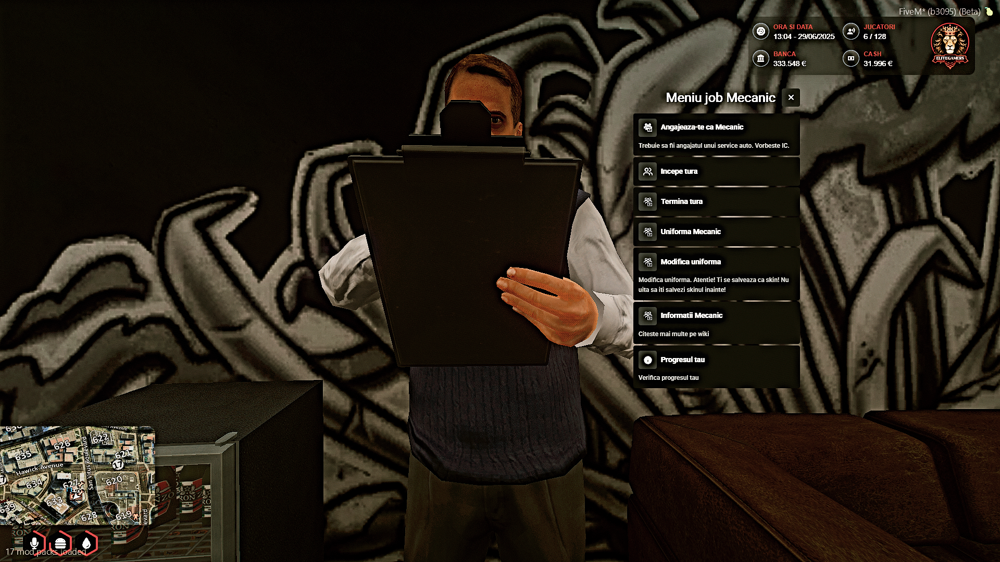
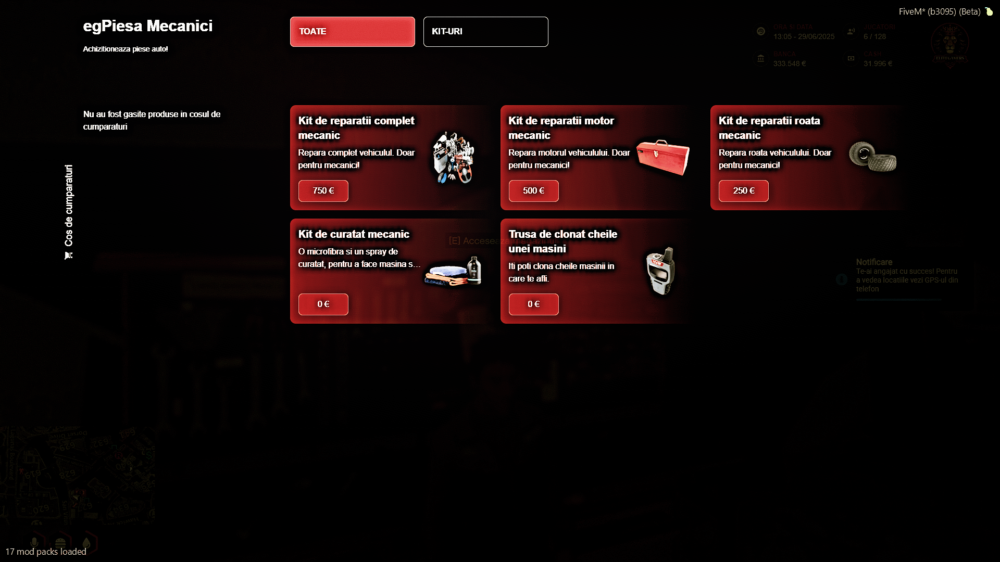
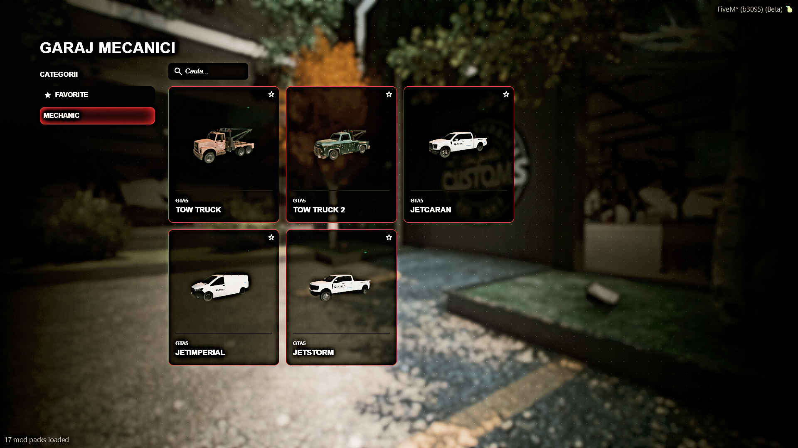

# 
Informatii despre ce presupune a fi un Mecanic

Mecanicii au un rol esential in intretinerea si repararea vehiculelor de pe server. Ca membru al factiunii de mecanici, vei raspunde la apelurile de ajutor pentru a repara vehicule avariate, a monta piese noi si a imbunatati performantele masinilor. Jobul tau este foarte cautat de soferi, fie ei civili sau membri ai altor factiuni, si ofera oportunitati de roleplay variate. Mecanicii pot oferi si servicii de tractare, iar uneori sunt chemati in situatii de urgenta pentru a elibera drumurile.

## Cum te angajezi la mecanici?

Simplu! Pe harta ai niste blips-uri cu bancnote de culoare portocalie, acolo se afla un NPC pentru angajare! Dupa ce iti alegi locul de angajare trebuie sa mergi la NPC-ul care se afla in service!

## MAGAZINUL DE PIESE

Pe langa NPC-ul de angajare, in orice service disponibil o sa gasitai si un magazin de piese destinat mecanicilor!

## Trebuie sa fac RP?

Da! Cand ajungi la service pentru angajare trebuie sa discuti cu un manager daca se afla in ORAS! In cazul in care nu este nimeni disponibil te poti angaja singur.

## Ce trebuie sa fac?

Trebuie sa stai la service si sa ajuti jucatorii pentru o experienta cat mai placuta! Cand un mecanic primeste apeluri trebuie sa accepte in cel mai scurt timp! Pentru a vedea apelurile trebuie sa apasati tasta F7.

## Ce masini am disponibile?

