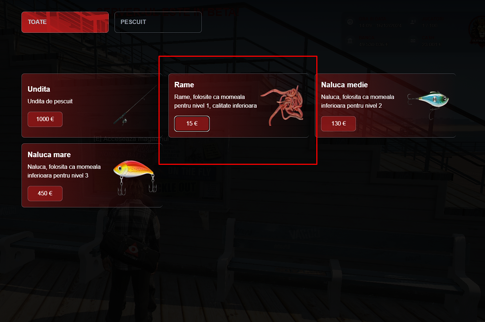
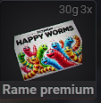
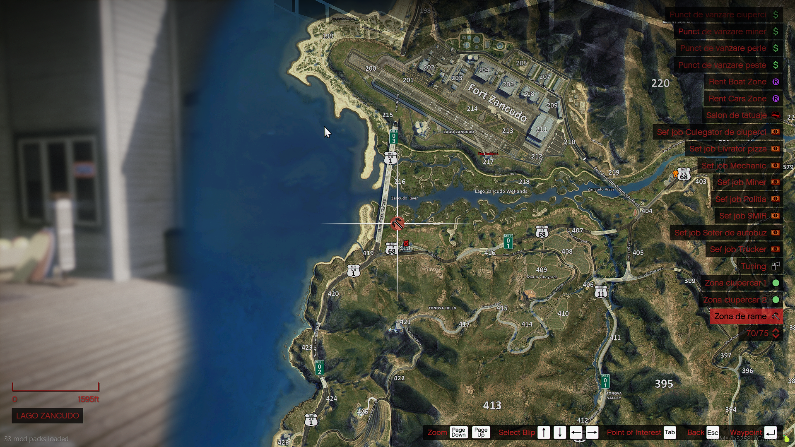

### Ce presupune Jobul de Pescar?

Ca pescar, vei naviga pe ape pentru a prinde diferite tipuri de pește. Prinde pește proaspăt și vinde-l pe piața locală sau direct către NPC. 
Ai nevoie de o barcă și unelte specifice pentru a avea succes în acest job. Pescuitul este relaxant și bine plătit dacă prinzi pești rari. Fiecare nivel de experiență îți oferă acces la specii de pești mai valoroși și la metode mai eficiente de pescuit.
- Pe lângă pescuit, ai posibilitatea de a colecta sau crafta momeală, fiecare metodă având avantajele sale. Alegerea momelii potrivite influențează direct tipul și calitatea peștilor prinși, precum și veniturile obținute.

### Cum mă angajez?

Pentru a începe acest job, trebuie să mergi la Primărie ([/gps - Primărie]) unde un NPC de la tejghea te va introduce in meniul interactiv de unde poti selecta job-ul "Pescar".

:::details Locatie Primarie
{.eg-pescar-photo}
:::

:::details NPC
{.eg-pescar-photo}
:::

### Prezentare job - Youtube

<iframe 
  width="560" 
  height="315" 
  src="https://www.youtube.com/embed/qPIeIlkk10Y"
  title="YouTube video player" 
  frameborder="0" 
  allow="accelerometer; autoplay; clipboard-write; encrypted-media; gyroscope; picture-in-picture" 
  allowfullscreen>
</iframe>

Dupa ce ai finalizat primul pas trebuie cumperi si echipamentul corespunzator. Vizitează magazinul de unelte de pescuit pentru a cumpăra o undiță și momeală de bază. Dacă preferi să economisești bani, poți colecta rame din [/gps - Loc rame].

(De scris despre zonele de pescuit)

### Opțiuni pentru momeală:

Pe server, ai mai multe variante de a-ți procura momeala, fiecare cu avantajele și dezavantajele ei:

1. Momeala cumpărată de la NPC:  
Este cea mai simplă și rapidă variantă. Dacă nu vrei să pierzi timp, poți merge la magazinul dedicat și să cumperi momeala direct, gata de folosit. Totuși, această opțiune poate deveni costisitoare pe termen lung. [/gps - Magazin pescar]

:::details Momeala NPC
{.eg-pescar-photo}
:::

:::details Rame Premium
{.eg-pescar-photo}
:::

2. Ramele culese manual:  
Pentru cei care vor să economisească bani, pot alege să culeagă rame din locația speciala marcata pe hartă care se regaseste si in [/gps]. Este o variantă mai ieftină, dar care necesită timp și un pic de efort.

:::details Locatia Rame Premium
{.eg-pescar-photo}
:::

3. Momeala craftată:  
Pentru pescarii mai experimentați, craftingul momelii din pești este cea mai eficientă soluție. Aceasta te ajută să-ți faci propriul stoc de momeală de calitate, perfectă pentru capturile mai valoroase.

### Informatii UTILE

<ul>
<li>După ce ai umplut ghiozdanul sau barca cu pești, îi poți vinde în funcție de preferințele tale. Ai opțiunea de a-i vinde la NPC-ul din [/gps] sau de a-i vinde pe piața publică jucătorilor care au nevoie de pești pentru skill-ul 2.</li>
<li>Nivelurile jobului:</li>
</ul>

:::details Punct Vanzare Pesti
{.eg-pescar-photo}
:::

<ul>
<li><strong>Nivel 1 (25 ore):</strong> La acest nivel, vei prinde pești comuni precum carasul mic, plătica și hamsia. Este o etapă introductivă potrivită pentru cei care abia încep jobul.</li>
<li><strong>Nivel 2 (200 ore):</strong> Acest nivel îți oferă acces la specii mai mari și mai valoroase, precum somnul, păstrăvul și știuca. Necesită momeli mai avansate.</li>
<li><strong>Zone de pescuit:</strong></li>
<ul>
<li>Fiecare locație de pescuit are speciile sale specifice. Acestea se gasesc si in [/gps].</li>
<li>Acest job se poate practica de la Skill 1 fara barca deoarece locatia default se afla pe pontonul mare din Los Santos. In momentul in care intri in raza job-ului o sa primesti o notificare daca te afli in locul potrivit job-ului.</li>
<li>Pretul unei undite este de 1000 de euro care are 100 de folosiri.</li>
<li>Incepand de la Skill 2 vei avea nevoie de o barca pe care o poti cumpara din [/gps - dealership barci]. Fiecare barca difera prin capacitatea de stocare a obiectelor sau in functie de viteza/manevrabilitate. Orice barca are si un mic dezavantaj pentru a echilibra jocul.</li>
</ul>
</ul>

  <h3 style="color: #ff2323;">Lista cu pești - Skill 1</h3>
  <ul>
    <li style="color: #eee;">Platica mică</li>
    <li style="color: #eee;">Morunaș mic</li>
    <li style="color: #eee;">Sprot mic</li>
    <li style="color: #eee;">Guvid mic</li>
    <li style="color: #eee;">Hamsii mici</li>
    <li style="color: #eee;">Roșioară mică</li>
    <li style="color: #ff2323;"><strong>Homar</strong> - Bonus</li>
  </ul>

  <h3 style="color: #ff2323;">Lista cu pești - Skill 2</h3>
  <ul>
    <li style="color: #eee;">Șalău Mediu</li>
    <li style="color: #eee;">Somn Mediu</li>
    <li style="color: #eee;">Păstrăv Mediu</li>
    <li style="color: #eee;">Știucă Medie</li>
    <li style="color: #eee;">Biban Mediu</li>
    <li style="color: #eee;">Clean Mediu</li>
    <li style="color: #eee;">Avat Mediu</li>
    <li style="color: #ff2323;"><strong>Pește Mandarin</strong> - Bonus</li>
  </ul>

### Despre momeala:

Pentru skill 1 ai nevoie strict de rame, ramele se pot cumpara de la NPC sau poti culege rame premium din [/gps - Loc rame]. Metodologia de folosire a ramelor este bazata pe bonus-ul de la fiecare skill si pe sansele de a prinde gunoi in timpul in care pescuiesti.  
Pentru skill 2 ai nevoie de Nada care se crafteaza din pesti sau de Naluca pe care o poti cumpara de la NPC. Fiecare jucator are libertatea de a folosii orice varianta mentionata atat timp cat respecta regulile server-ului.

