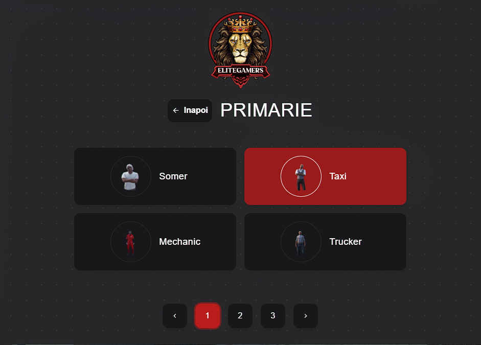

---

### Ce presupune Jobul de Pescar?

Ca pescar, vei naviga pe ape pentru a prinde diferite tipuri de pește. [...] Alegerea momelii potrivite influențează direct tipul și calitatea peștilor prinși, precum și veniturile obținute.

### Cum mă angajez?

Pentru a începe acest job, trebuie să mergi la Primărie ([/gps - Primărie]) unde un NPC de la tejghea te va introduce în meniul interactiv.

:::details Locatie Primarie
{.framed-photo}
:::

:::details NPC
{.framed-photo}
:::

### Prezentare job - Youtube

<iframe 
  width="560" 
  height="315" 
  src="https://www.youtube.com/embed/qPIeIlkk10Y"
  title="YouTube video player"
  frameborder="0"
  allow="accelerometer; autoplay; clipboard-write; encrypted-media; gyroscope; picture-in-picture" 
  allowfullscreen>
</iframe>

Dupa ce ai finalizat primul pas trebuie cumperi si echipamentul corespunzator. [...]

(De scris despre zonele de pescuit)

### Opțiuni pentru momeală:

1. Momeala cumpărată de la NPC:  
[...] [/gps - Magazin pescar]

:::details Momeala NPC
{.framed-photo}
:::

:::details Rame Premium
{.framed-photo}
:::

2. Ramele culese manual:  
[...] [/gps]

:::details Locatia Rame Premium
{.framed-photo}
:::

3. Momeala craftată:  
Pentru pescarii mai experimentați, craftingul momelii din pești este cea mai eficientă soluție.

### Informatii UTILE

<ul>
<li>După ce ai umplut ghiozdanul sau barca cu pești, îi poți vinde în funcție de preferințele tale [...]</li>
<li>Nivelurile jobului:</li>
</ul>

:::details Punct Vanzare Pesti
{.framed-photo}
:::

<ul>
<li><strong>Nivel 1 (25 ore):</strong> [...]</li>
<li><strong>Nivel 2 (200 ore):</strong> [...]</li>
<li><strong>Zone de pescuit:</strong></li>
<ul>
<li>Fiecare locație de pescuit are speciile sale specifice [...]</li>
<li>Pretul unei undite este de 1000 de euro [...]</li>
<li>Incepand de la Skill 2 vei avea nevoie de o barca [...]</li>
</ul>
</ul>

  <h3 style="color: #ff2323;">Lista cu pești - Skill 1</h3>
  <ul>
    <li>Platica mică</li>
    <li>Morunaș mic</li>
    <li>Sprot mic</li>
    <li>Guvid mic</li>
    <li>Hamsii mici</li>
    <li>Roșioară mică</li>
    <li style="color: #ff2323;"><strong>Homar</strong> - Bonus</li>
  </ul>

  <h3 style="color: #ff2323;">Lista cu pești - Skill 2</h3>
  <ul>
    <li>Șalău Mediu</li>
    <li>Somn Mediu</li>
    <li>Păstrăv Mediu</li>
    <li>Știucă Medie</li>
    <li>Biban Mediu</li>
    <li>Clean Mediu</li>
    <li>Avat Mediu</li>
    <li style="color: #ff2323;"><strong>Pește Mandarin</strong> - Bonus</li>
  </ul>

### Despre momeala:

Pentru skill 1 ai nevoie strict de rame [...]  
Pentru skill 2 ai nevoie de Nada craftabilă sau Nalucă cumpărată.

