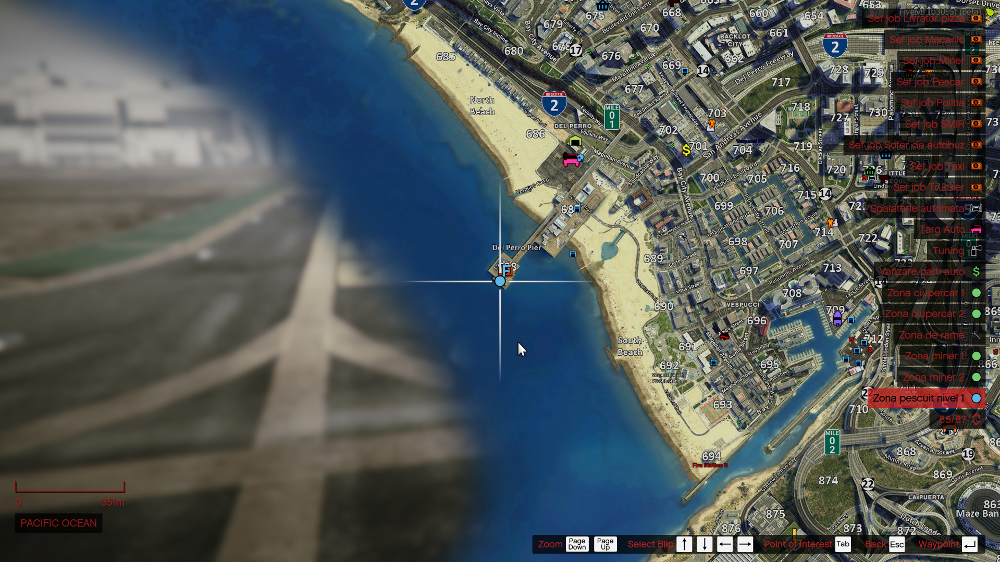

---

### Ce presupune Jobul de Pescar?

Jobul de pescar îți oferă ocazia să descoperi liniștea apelor și satisfacția unei prăzi reușite. Este un parcurs bazat pe experiență și răbdare, unde fiecare nivel atins deschide noi orizonturi: de la pescuitul simplu pe ponton, la explorarea lacurilor cu barca și, în cele din urmă, la adevărata aventură pe ocean, unde doar cei mai experimentați pescari se pot încumeta.

### Cum mă angajez?

Pentru a începe acest job, trebuie să mergi la Primărie unde un NPC de la tejghea te va introduce în meniul interactiv sau te poți angaja dacă vorbești cu șeful pescar.

:::details NPC Primărie
{.framed-photo}
:::

:::details Șeful Pescar
{.framed-photo}
:::

### Prezentare job - Youtube

<iframe 
  width="660" 
  height="355" 
  src="https://www.youtube.com/embed/qPIeIlkk10Y"
  title="YouTube video player"
  frameborder="0"
  allow="accelerometer; autoplay; clipboard-write; encrypted-media; gyroscope; picture-in-picture" 
  allowfullscreen>
</iframe>

### Informatii UTILE

<ul>
<li>Jobul de pescar se împarte pe 3 nivele, unde primul nivel este pescarul începător unde sunt necesare o undiță și râme normale sau râme premium.</li>
<li>Următorul nivel reprezentând nivelul Avansat care necesită și el la rândul lui Nălucă Medie Cumpărată sau Nada Medie craftată.</li>
<li>Ultimul nivel este Pescarul Expert care necesită Nălucă Mare sau Nălucă Mare craftată.</li>
  
<li>Începând cu pescarul avansat, este necesară achiziționarea unei bărci pentru a putea ajunge în zona prestabilită nivelului.</li>
<li>La momentul potrivit, peștii se pot vinde la NPC sau se pot duce la procesare pentru Nada Medie și/sau Nada Mare pentru celelalte Nivele (poze mai jos).</li>
<li>Râmele Premium, Nada Medie și Nada Mare îmbunătățesc șansă de a prinde pești rari.</li>
</ul>

:::details Punct Vânzare Pești
{.framed-photo}
:::

:::details Locație Procesare Momeală
{.framed-photo}
:::

### Nivelurile jobului

<ul>
<li>Pentru Pescar Începător sunt necesare <b>25</b> ore.</li>
<li>Pentru Pescar Avansat sunt necesare <b>200</b> ore.</li>
  
<li><b>Locațiile de pescuit:</b></li>
<ul>
<li>În fiecare locație de pescuit sunt găsiți pești de diferite feluri.</li>
<li>Prețul unei Undițe este de 1.000 euro și se poate cumpăra de NPC pe care îl găsiți la locația pescarului începător.</li>
<li>Începând cu nivelul Avansat este necesară achiziționarea unei bărci pentru a putea practică acest nivel dar și nivelul Expert al acestui job.</li>
</ul>
</ul>

:::details Locație Harta | Pescar Începător
{.framed-photo}
:::

:::details Locație Harta | Pescar Avansat
{.framed-photo}
:::

### Lista speciilor

  <h3 style="color: #ff2323;">Pescar Începător</h3>
  <ul>
    <li>Platica mică</li>
    <li>Morunaș mic</li>
    <li>Sprot mic</li>
    <li>Guvid mic</li>
    <li>Hamsii mici</li>
    <li>Roșioară mică</li>
    <li style="color: #ff2323;"><strong>Homar</strong> - Bonus</li>
  </ul>

  <h3 style="color: #ff2323;">Pescar Avansat</h3>
  <ul>
    <li>Șalău Mediu</li>
    <li>Somn Mediu</li>
    <li>Păstrăv Mediu</li>
    <li>Știucă Medie</li>
    <li>Biban Mediu</li>
    <li>Clean Mediu</li>
    <li>Avat Mediu</li>
    <li style="color: #ff2323;"><strong>Pește Mandarin</strong> - Bonus</li>
  </ul>

