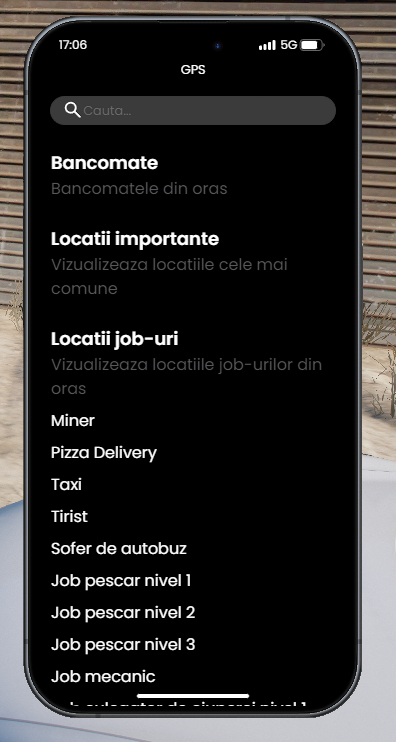
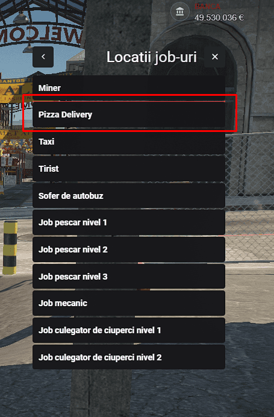

### Ce presupune acest job de livrator pizza?

  Jobul de livrator pizza implică livratul cutiilor de pizza în orașul Los Santos. La început vei livra câte 5 pizza pe tură cu un scuter, dar pe măsură ce acumulezi experiență pe server vei putea livra câte 10 folosind o mașină dedicată acestui job.

### Cum mă angajez?

  Pentru a începe, trebuie să deții un permis de conducere, pe care îl poți obține de la școala de șoferi, trecând mai întâi printr-un test teoretic, urmat de unul practic. După ce obții permisul, trebuie să mergi la Primărie, unde un NPC de la tejghea te va introduce în meniul interactiv, de unde poți selecta locul de muncă dorit. În cazul vrei să accesezi <b>Skill 2 - Livrator Pizza Avansat</b>, ai nevoie de 25 ore.

:::details Locatie Primarie
{.framed-photo}
:::

  Pentru a începe tura, va trebui să mergi la NPC-ul din pizzerie ([/gps - Jobs - Livrator Pizza]), să îți iei uniforma, să intri la datorie și să duci cutiile de pizza la vehicul de pe masă folosind tasta "G" pentru a le lua.

:::details Locatie /gps | Pizza
{.framed-photo}
:::

### Prezentare job - YouTube

<iframe 
  width="560" 
  height="315" 
  src="https://www.youtube.com/embed/l9hLwMOz438"
  title="YouTube video player" 
  frameborder="0" 
  allow="accelerometer; autoplay; clipboard-write; encrypted-media; gyroscope; picture-in-picture" 
  allowfullscreen>
</iframe>

### Informații suplimentare:

  <ul>
    <li><b>Livrator Pizza (Skill 1):</b> Poți practica acest job de la 0 ore.</li>
    <li><b>Livrator Pizza Avansat (Skill 2):</b> Deblochezi acest nivel la atingerea de 25 de ore jucate.</li>
    <li>Vei fi obligat să folosești uniforma specifică pe care o poți primi de la NPC-ul din Pizzerie.</li>
    <li>Ai voie să folosești doar vehiculele specifice jobului.</li>
    <li>Plata se face pe fiecare cutie livrată.</li>
  </ul>

