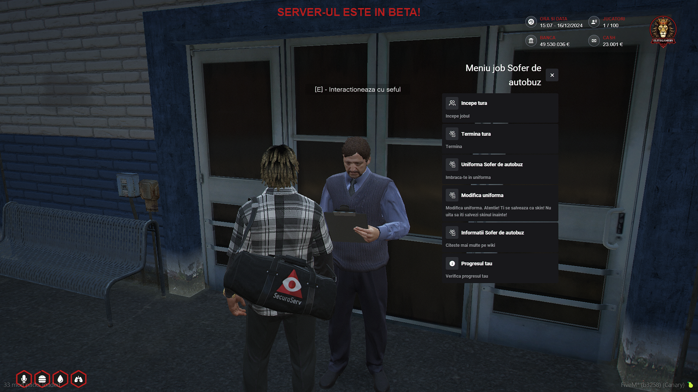

### Ce presupune Job-ul "Sofer de Autobuz"?

Jobul de sofer de autobuz implica transportul pasagerilor intre statii prestabilite in orasul Los Santos, respectarea rutelor si regulilor de trafic. Pe tot parcursul job-ului, datoria ta este sa opresti in statiile indicate pe harta, sa preiei NPC-uri si sa le transporti la destinatiile marcate prin checkpoint-uri. Dupa ce finalizezi cursele, trebuie sa te intorci la sediu pentru a incheia tura si a primi plata in functie de turele efectuate. Acesta este unul dintre cele mai potrivite job-uri pentru un jucator nou, oferind o modalitate simpla si eficienta de a castiga bani.

### Cum pot incepe acest job?

Pentru a incepe, trebuie sa detii un permis de conducere, pe care il poti obtine de la scoala de soferi, trecand mai intai printr-un test teoretic, urmat de unul practic. Dupa ce obtii permisul, trebuie sa mergi la Primarie, unde un NPC de la tejghea te va introduce in meniul interactiv, de unde poti selecta locul de munca dorit. In final, trebuie sa mergi la sediul soferului de autobuz, pe care il gasesti in [/gps - Jobs -> Sofer de Autobuz]. Acolo, un NPC te va astepta si vei putea interactiona cu el pentru a putea primi uniforma si incepe cursa dorita.

:::details Locatie Primarie
{.framed-photo}
:::

:::details NPC
{.framed-photo}
:::

:::details Sef | Sofer Autobuz
{.framed-photo}
:::

### Prezentare job - Youtube

<iframe 
  width="560" 
  height="315" 
  src="https://www.youtube.com/embed/U1SpKQ-B0T4"
  title="YouTube video player" 
  frameborder="0" 
  allow="accelerometer; autoplay; clipboard-write; encrypted-media; gyroscope; picture-in-picture" 
  allowfullscreen>
</iframe>

### Informatii suplimentare:

<ul>
<li>Acest job se poate practica incepend de la 0 ore, special pentru jucatorii noi care doresc sa inceapa un job spre cladirea unei cariere in orasul Los Santos,</li>
<li>Vehiculul pe care il vei conduce este un: "BRUTE Bus", foarte bun cand vine vorba despre transportul cetatenilor oferind comfort si siguranta,</li>
<li>Plata la final se bazeaza strict pe numarul de statii efectuate pe toata perioada job-ului,</li>
<li>Este obligatoriu ca fiecare cetatean care efectueaza acest job sa poarte uniforma dedicata,</li>
<li>La fiecare statie trebuie sa astepti ca toti pasagerii sa urce/coboare din autobuz,</li>
</ul>

