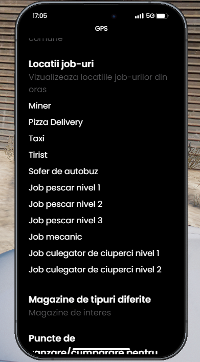

### Ce presupune Jobul de taximetrist?

Jobul de taximetrist implica preluarea clientilor din diferite locatii si transportul lor la destinatiile dorite. Va trebui sa te ocupi de cursele lor, respectand regulile de trafic si avand grija sa nu intampini accidente. Pe parcursul job-ului, vei castiga bani in functie de numarul de Km efectuati.

### Cum pot incepe acest job?

Pentru a incepe, trebuie sa detii un permis de conducere, pe care il poti obtine de la scoala de soferi, trecand mai intai printr-un test teoretic, urmat de unul practic. Dupa ce obtii permisul, trebuie sa mergi la Primarie, unde un NPC de la tejghea te va introduce in meniul interactiv, de unde poti selecta locul de munca dorit.

:::details Locatie Primarie
{.framed-photo}
:::

:::details NPC
{.framed-photo}
:::

Dupa ce te-ai angajat de la Primarie, trebuie sa mergi la locul de munca de unde pleaca si taxi-urile, pe care il gasesti in [/gps - Jobs -> Taximetrist].

:::details Unde gasesti job-ul?
{.framed-photo}
:::

Dupa ce ai selectat masina dorita de la [Objectul Albastru] trebuie sa intri in vehiculul job-ului pentru a fi la datorie. P.S: Pentru a deschide meniul cu toate comenzile apasa tasta [/F7].

### Pe server avem doua variante pentru acest job:

<strong>Cu playeri</strong> – Poti prelua alti jucatori ca pasageri din [F7], avand optiunea sa folosesti „maimuta” (metoda prin care poti creste pretul per KM in taximetru), insa exista riscul de a fi prins. Poti prelua un nou apel doar dupa ce ai finalizat cursa pentru apelul curent.

<strong>Cu NPC-uri</strong> – In cazul in care nu sunt jucatori care necesita serviciile unui taximetrist o sa primesti curse automate de la NPC-uri unde ceasul este prestabilit in functie de checkpoint. In acest caz, nu poti folosi „maimuta” pentru a trisa. Poti prelua un nou apel doar dupa ce ai finalizat cursa pentru apelul curent.

### Informatii utile:

<ul>
<li>Te poti angaja la acest job direct de la 0 ore,</li>
<li>Regulile din trafic trebuie respectate oferind pasagerilor siguranta pe tot parcursul calatoriei,</li>
<li>Taxi-ul pe care o sa il conduci este un "Rhinehart Taxi",</li>
<li>De la NPC-uri poti sa primesti si curse mai lungi, chiar si in Sandy,</li>
<li>Plata este bazata in functie de nr-ul de Km parcursi.</li>
</ul>

