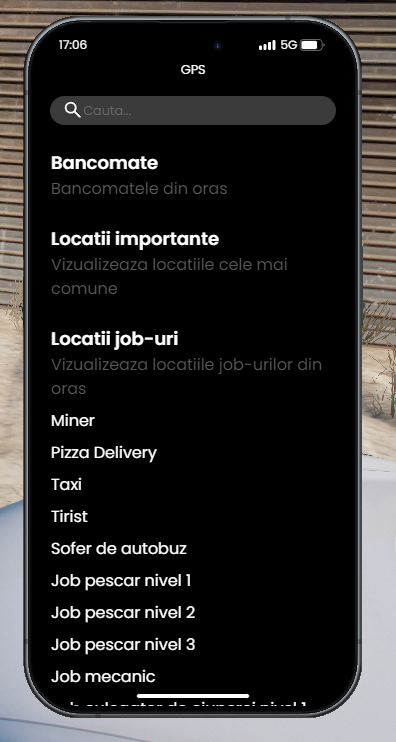

<!-- LOGO CLAR, FĂRĂ COLȚURI/MARGINI -->

### Ce presupune acest job de trucker?

  Jobul de trucker implică transportul mărfurilor între diferite destinații, folosind tirul companiei. La început, vei face curse normale pentru aprovizionarea magazinelor, benzinăriilor sau transportul de vehicule. Pe măsură ce avansezi, poți accesa curse mai complexe și riscante, precum transportul de mărfuri periculoase. Plata este făcută pe kilometru parcurs, iar performanța ta este recompensată în funcție de cum parchezi la destinație. 
  Traseele sunt tematice, în funcție de tipul de marfă transportată, iar destinațiile se calculează automat în funcție de locația ta curentă, pentru a permite organizarea de convoaie cu alți jucători.

### Cum mă angajez?

Pentru a începe, trebuie să deții un permis de conducere, pe care îl poți obține de la școala de șoferi, trecând mai întâi printr-un test teoretic, urmat de unul practic. După ce obții permisul, trebuie să mergi la Primărie, unde un NPC de la tejghea te va introduce în meniul interactiv, de unde poți selecta locul de muncă dorit.

:::details Locatie Primarie

:::

:::details NPC

:::

  Pentru a începe jobul de trucker, ai nevoie de <b>50 ore jucate</b>. În cazul în care vrei să accesezi <b>Skill 2 - Șofer Avansat</b>, ai nevoie de <b>200 ore jucate</b> și o licență suplimentară pentru transportul de mărfuri periculoase. Licența poate fi obținută de la patronul jobului (NPC-ul), care costă 30.000 de euro și este obligatorie pentru cursele de acest tip.

### Informații suplimentare:

Skill-uri disponibile:

  <ul>
    <li><b>Șofer Începător (Skill 1):</b> Curse simple și sigure, precum aprovizionarea magazinelor sau benzinăriilor.</li>
    <li><b>Șofer Avansat (Skill 2):</b> Permite accesul la transporturi periculoase, precum mărfuri explozive sau chimice. Aceste curse sunt bine plătite, dar trailer-ul poate exploda dacă nu ești atent, ceea ce crește riscul.</li>
  </ul>

<ul>
  <li><b>Restricții în funcție de nivel:</b> Tipurile de traseu și mărfurile transportate sunt blocate până atingi un anumit nivel al jobului.</li>
  <li><b>Trasee tematice:</b>
    <ul>
      <li>Curse specifice pentru anumite categorii de produse (combustibil, vehicule, produse pentru magazine).</li>
      <li>Cursele se pot face doar cu tirul oferit de firmă. La fiecare cursă nouă, tirul și remorca sunt resetate automat.</li>
      <li>Destinațiile includ locații variate, iar fiecare parcare îți oferă recompense diferite în funcție de calitatea parcării (proastă, ok, foarte bună).</li>
    </ul>
  </li>
  <li><b>Convoaie:</b> Toți jucătorii au aceleași trasee, astfel încât să poată forma convoaie pentru realism și distracție.</li>
</ul>

