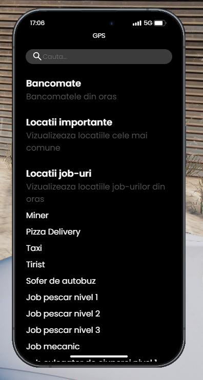
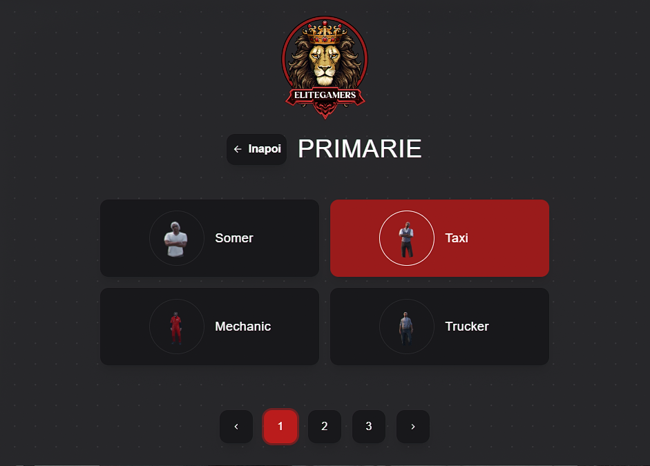

### Ce presupune acest job de vânător?

<eg-vanator-box>
  Jobul de vânător presupune să vânezi animale sălbatice într-o zonă delimitată de pe hartă, să le tranșezi la fața locului și să vinzi carnea și trofeele la un NPC specializat. Nu este un job în care aduni ce găsești pe jos: fiecare animal trebuie împușcat, iar arma contează. Este cel mai greu de deblocat job legal de pe server și, pe măsură, cel mai bine plătit.
</eg-vanator-box>

### Cum mă angajez?

<eg-vanator-box>
  Pentru a putea începe acest job ai nevoie de <b>750 de ore jucate</b>, cel mai ridicat prag al unui job legal. Mergi la Primărie ([/gps - Primărie]), iar NPC-ul de la tejghea îți va permite să selectezi jobul de vânător.
</eg-vanator-box>

:::details Locatie Primarie
{.framed-photo}
:::

:::details NPC
{.framed-photo}
:::

### De ce ai nevoie

<eg-vanator-box>
  <ul style="line-height: 1.6; font-size: 1.1em; padding-left: 1.3em;">
    <li><b>Pușcă de vânătoare</b> — singura armă care lasă blana întreagă. Se cumpără de la un magazin de arme sau se fabrică acolo la masa de crafting.</li>
    <li><b>Muniție pentru pușca de vânătoare</b> — se cumpără sau se fabrică la aceeași masă.</li>
    <li><b>Un cuțit în inventar</b> — pentru tranșare. Nu trebuie ținut în mână, doar să îl ai la tine.</li>
    <li><b>Un vehicul cu portbagaj</b> — un animal tranșat ocupă loc, iar drumul până la punctul de vânzare merită făcut cu marfa strânsă.</li>
  </ul>
</eg-vanator-box>

::: warning Doar pușca de vânătoare îți dă ceva
Dacă animalul a fost ucis cu orice altceva — pistol, pușcă, mașină, cuțit — tranșarea eșuează și nu primești nimic. Cadavrul rămâne pe jos două minute, apoi dispare. Un glonț greșit înseamnă un animal irosit.
:::

### Cum funcționează

<eg-vanator-box>
  <ol style="line-height: 1.6; font-size: 1.1em; padding-left: 1.3em;">
    <li>Intri în zona de vânătoare și ești pus automat pe duty.</li>
    <li>Găsești un animal și îl împuști <b>cu pușca de vânătoare</b>. Unele animale mor din două focuri, altele au nevoie de trei sau patru.</li>
    <li>Te apropii de cadavru și ții apăsat <b>E</b> pentru a-l tranșa (aproximativ 8 secunde).</li>
    <li>Primești mereu carne și, cu o anumită șansă, un trofeu — coarne, colți, blană sau gheare.</li>
    <li>Când ai strâns destul, mergi la punctul de vânzare și vinzi tot.</li>
  </ol>
</eg-vanator-box>

::: tip Urmele de pe jos
Prin zonă găsești urme de animale. Apasă <b>E</b> pe ele, îngenunchezi și le cercetezi, iar personajul îți spune ce animal a trecut pe acolo și în ce direcție a luat-o. Nu îți pune nimic pe hartă — îți dă doar o direcție, restul e treaba ta.
:::

### Animalele

<eg-vanator-box>
  <ul style="line-height: 1.6; font-size: 1.1em; padding-left: 1.3em;">
    <li><b>Iepure, cerb, porc sălbatic, mistreț</b> — vânatul de bază, cel mai des întâlnit.</li>
    <li><b>Pescăruș, cormoran</b> — ținte mici și rapide. Greu de nimerit cu o armă cu un singur foc, dar penele se vând bine.</li>
    <li><b>Uliu</b> — cel mai rar și cel mai valoros. Ghearele lui sunt cel mai scump trofeu din tot jobul.</li>
    <li><b>Coiot și pumă</b> — <b>atacă</b>. Nu fug de tine și nu se sperie de focuri de armă.</li>
  </ul>
</eg-vanator-box>

::: danger Coioții și pumele te atacă
Restul animalelor fug când te apropii. Astea două vin după tine, iar puma are nevoie de patru focuri. Ține minte că pușca se reîncarcă încet — dacă ratezi primul foc, ai o problemă.
:::

::: info Un foc de armă sperie tot vânatul din jur
Când tragi, animalele din apropiere o iau la fugă. Un foc ratat nu costă doar glonțul, ci și animalele pe care le-ai fi putut vâna în continuare acolo.
:::

### Unde vând?

<eg-vanator-box>
  Carnea și trofeele se vând la un NPC bucătar dedicat, marcat pe hartă. Are nevoie să ai jobul de vânător activ. Prețurile beneficiază de <b>VIP job boost</b>.
</eg-vanator-box>

### Licența de vânătoare

<eg-vanator-box>
  Poți cumpăra o <b>licență de vânătoare</b> de la Centrul de licențe, valabilă 7 zile. Nu îți trebuie ca să vânezi — jobul funcționează și fără ea. Este un act pe care ți-l poate cere <b>poliția</b>, iar dacă vânezi fără el rămâne la latitudinea lor ce urmează.
</eg-vanator-box>

### Informații suplimentare

<ul style="max-width: 700px; margin: 0 auto 40px auto; line-height: 1.6; font-size: 1.1em; padding-left: 1.3em;">
  <li>Ai nevoie de 750 de ore jucate pentru a putea practica acest job.</li>
  <li>Zona de vânătoare este <b>safezone</b>: nimeni nu poate deschide focul acolo. Singura excepție este vânătorul cu pușca de vânătoare în mână.</li>
  <li>Animalele apar treptat, nu toate odată. Cu cât sunt mai mulți vânători în zonă, cu atât mai multe animale.</li>
  <li>Pușca de vânătoare se uzează și se strică după un timp. Fă-ți rost de mai multe sau de materiale pentru încă una.</li>
  <li>Nu există restricții în legătură cu transportul folosit.</li>
  <li>Plata este în funcție de animalul tranșat și de trofeul obținut.</li>
</ul>

