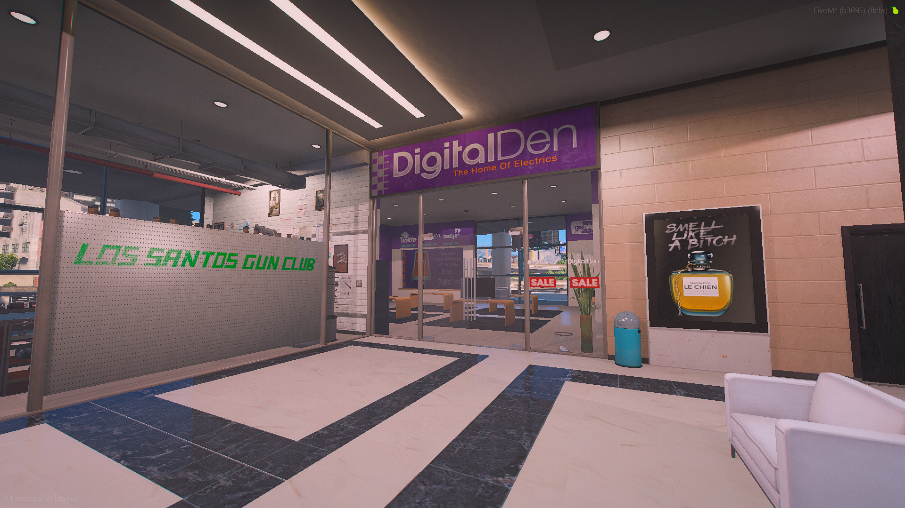
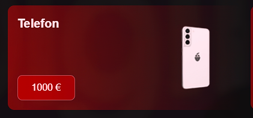
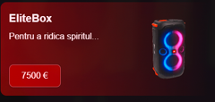
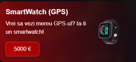
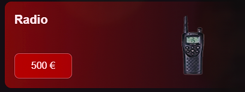

### 
 DigitalDen by eliteGamers

  <strong style="color: #d72638;">💡 Despre DigitalDen:</strong> Pe server avem mai multe locatii pentru DigitalDen, intra pe server si ai pe harta un blip de culoare albastra (cos de cumparaturi). 

  

  <h2 style="font-size: 2.2rem; font-family: 'Segoe UI', sans-serif; color: #d72638; letter-spacing: 1px; margin-bottom: 0.5rem;">
    
      CE GASESTI ÎN MAGAZINELE NOASTRE?
    
  </h2>

### 
1. Telefon 

- Un smartphone modern, ideal pentru apeluri, mesaje și social media.

::: danger Pret
Preț: 1000 €
:::

::: details Telefon
  
:::

### 
2. EliteBox 

Boxă portabilă cu lumini LED integrate, perfectă pentru petreceri sau relaxare acasă.
Sunet puternic și clar, ideal pentru orice tip de muzică.

::: danger Pret
Preț: 7500 €
:::

::: details EliteBox
  
:::

### 
3. SmartWatch (GPS) 

Ceas inteligent cu funcție GPS integrată.
::: danger Pret
Preț: 5000 €
:::

::: details SmartWatch (GPS)
  
:::

### 
4. Statie Radio 

Radio portabil, ușor de folosit.

::: danger Pret
Preț: 500 €
:::

::: details Statie Radio 
  
:::

