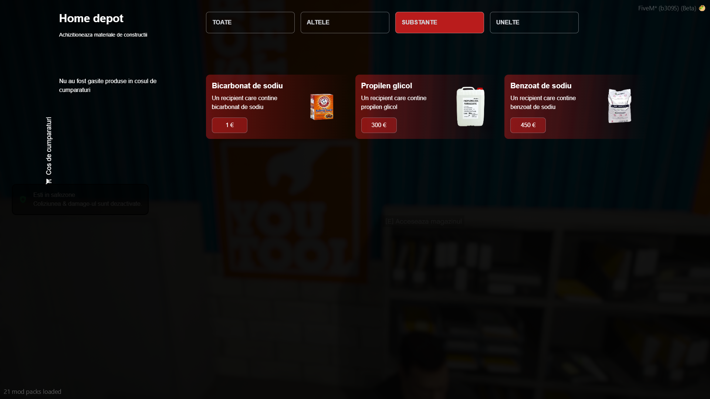

--- 
outline: deep 
---

### 
 Home Depot 

  <strong style="color: #ffcc00;">HomeDepot:</strong> Localizat la codul poștal <strong>313</strong>, marcat pe hartă cu un <strong>blip galben</strong>, situat în <strong>Sandy Shores</strong>.
  <ul>
    <li>Aici poți cumpăra orice materiale sau obiecte de care ai nevoie pentru construcții și îmbunătățiri.</li>
    <li>Produsele sunt diverse: unelte, materiale de construcție și accesorii.</li>
    <li>Punct de reper vizibil pe hartă, ușor de găsit pentru toți jucătorii care vizitează Sandy Shores.</li>
  </ul>

---

### 
1. Prezentare Generala

---

### 
2. Categoria altele

  
Aici găsești obiecte diverse și esențiale pentru viața de zi cu zi pe server.

  <ul class="eg-list">
    <li>Baterie de mașină – Se afla pe joc la ce se foloseste.</li>
    <li>Plic gol – util pentru transportul discret al unor iteme/necesar la unele crafting-uri.</li>
    <li>Hârtie – poate fi folosită în diverse combinații de crafting.</li>
    <li>Lemn – material de bază pentru construcții.</li>
    <li>Staniol – rolă de aluminiu pentru diferite utilizări.</li>
    <li>Carton – element pentru ambalaje și crafting.</li>
    <li>Folie transparentă – protecție și împachetare.</li>
    <li>Bandă adezivă – lipire rapidă și improvizații.</li>
    <li>Foițe + Filtre – consumabile pentru țigări.</li>
    <li>Parașută – posibilitatea de a cumpara parasuta pentru diverse activitati.</li>
  </ul>

---

### 
3. Categoria substante

  
Substanțe chimice și compuși folosiți în crafting și combinații speciale pe server.

  <ul class="eg-list">
    <li>Bicarbonat de sodiu – substanță de bază pentru rețete simple.</li>
    <li>Propilen glicol – lichid utilizat în procese avansate.</li>
    <li>Benzoat de sodiu – aditiv folosit ca conservant și în rețete chimice.</li>
  </ul>

### 
3. Categoria unelte

  
Iteme folosite pentru diverse activitati pe server.

  <ul class="eg-list">
    <li>Lockpick simplu – util pentru a descuia usi.</li>
    <li>Lockpick avansat – secretele se afla pe joc :D .</li>
    <li>Bormasina – Folosit pentru alte intentii.</li>
  </ul>

