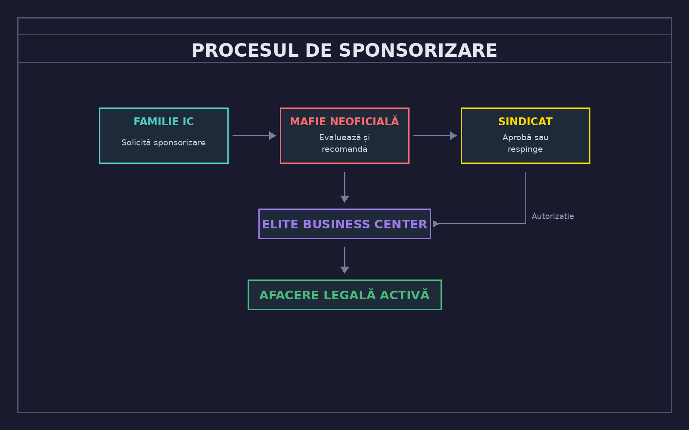

# 
FAMILIE IC - STADIUL I

<i>Primii pași în lumea criminală</i>

---

## Momentul zero - Nașterea

### Cerințe de înființare
- **Minimum 5 membri activi** care împărtășesc aceeași viziune
- **Lider(i) cu experiență** - minim 16 ani, fără sancțiuni grave, reputație bună
- **Nume ales cu grijă** - odată stabilit, nu se mai poate schimba; numele trebuie să fie **fictiv**, nu poate coincide cu nume reale de organizații criminale
- **Ore jucate** - toți membrii recrutați în familie trebuie să aibă **minim 50 de ore jucate**
- **Poveste de fundal** - de unde vin membrii, ce îi unește, care e scopul

### Pașii concreți
1. Formați nucleul - găsiți 3-4 persoane de încredere absolută
2. Stabiliți identitatea - nume, culori orientative, stil
3. Recrutați până la 5+ membri activi
4. Faceți-vă remarcați în oraș prin activitate și roleplay de calitate
5. Dovediți-vă valoarea prin acțiuni, nu vorbe

::: danger PAS CRUCIAL
**Intrați în vizorul unei Mafii Neoficiale din zona voastră de activitate.** Fără atenția și recomandarea unei mafii neoficiale, familia voastră nu poate avansa. Aceasta este poarta către următorul nivel.
:::

---

## Perioada de probă și dovadă

În această fază, familia trebuie să **demonstreze** că merită atenția:

### Ce se evaluează
- **Activitatea** - prezența constantă și implicarea membrilor
- **Calitatea roleplay-ului** - scenarii complexe, nu doar acțiuni random
- **Disciplina** - respectarea regulamentului, lipsa sancțiunilor
- **Coeziunea** - membrii lucrează ca o echipă, nu ca indivizi
- **Reputația** - cum sunt percepuți de ceilalți jucători

### Monitorizarea de către mafiile neoficiale
Familiile IC sunt observate și evaluate de **Mafiile Neoficiale** din zona lor de influență. Acestea au responsabilitatea de a:
- Identifica familiile IC promițătoare
- Evalua potențialul și calitatea roleplay-ului
- Raporta Sindicatului despre progresul familiilor
- Recomanda sau nu avansarea la stadiul următor

---

## Afaceri legale ca paravan - Sistemul de sponsorizare

::: tip OPORTUNITATE DE EXPANSIUNE
O familie IC poate achiziționa o **afacere legală** prin **Elite Business Center** pentru a o folosi ca paravan în recrutarea viitorilor membri. Această facilitate nu este un drept, ci un **privilegiu obținut prin relații**.
:::

### Cum funcționează

O familie IC nu poate cumpăra singură o afacere legală. Pentru aceasta, are nevoie de o **recomandare oficială** din partea unei **Mafii Neoficiale** care deține sferă de influență în zona în care familia IC activează.

### Cerințe pentru obținerea sponsorizării

| Cerință | Detalii |
|---------|---------|
| **Reputație** | Familia IC trebuie să aibă o imagine curată, fără scandaluri majore |
| **Activitate** | Prezență constantă și roleplay de calitate demonstrat |
| **Relație cu mafia sponsor** | Trebuie să fi colaborat anterior cu mafia neoficială |
| **Zonă de activitate** | Afacerea trebuie să fie în zona de influență a mafiei sponsor |
| **Plan de afaceri** | Trebuie prezentată o viziune clară a modului în care va fi folosită afacerea |

### Tipuri de afaceri potrivite ca paravan

- **Service auto** - recrutezi mecanici care "se dovedesc" a fi mai mult decât mecanici
- **Club/bar** - locul perfect pentru a cunoaște oameni și a-i evalua
- **Gunshop** - acces la arme și clienți cu interese similare
- **Benzinărie** - punct strategic, trafic constant, locație ideală pentru întâlniri
- **Magazin de haine** - fațadă elegantă, clienți variați, venituri stabile
- **Magazin** - flux constant de clienți potențiali
- **Spălătorie auto** - clasicul paravan, discret și profitabil

### Beneficiile sistemului

**Pentru familia IC:**
- **Sursă de venit legitimă** - bani curați care susțin operațiunile
- **Bază de recrutare** - angajații pot fi evaluați înainte de a fi abordați
- **Acoperire** - activitățile par legale din exterior
- **Reputație în oraș** - sunteți văzuți ca oameni de afaceri

**Pentru mafia neoficială (sponsor):**
- Mafia sponsor nu primește nicio taxă pentru recomandarea catre sindicat pentru preluarea unei afaceri - ea primește **loialitate** și **informații**
- **Influență extinsă** - mai multe afaceri sub umbrela lor în zonă
- **Loialitate** - familia IC le datorează acest privilegiu
- **Ochi și urechi** - informații despre ce se întâmplă în zonă
- **Rețea de contacte** - acces la potențiali recruți și aliați

### Obligații după obținerea afacerii

::: warning RESPONSABILITĂȚI
1. **Menținerea aparențelor** - afacerea trebuie să funcționeze legitim
2. **Raportare** - mafia sponsor trebuie informată despre activități
3. **Loialitate** - nu poți sponsoriza sau ajuta rivali ai mafiei sponsor
4. **Discreție** - recrutarea se face subtil, nu agresiv
5. **Taxa de protecție** - opțională cu consecințe, plătită la fiecare 2 săptămâni mafiei teritoriale
:::

### Pierderea privilegiului

Sponsorizarea poate fi retrasă dacă:
- Familia IC trădează încrederea mafiei sponsor
- Afacerea este folosită împotriva intereselor sponsorului
- Scandaluri majore care atrag atenția nedorită
- Familia IC primește sancțiuni grave (MW sau ban membri)

În acest caz, afacerea poate fi **confiscată** sau **vândută forțat**, iar familia IC pierde dreptul de a solicita o nouă sponsorizare pentru o perioadă determinată de Sindicat.

### Taxa de protecție teritorială

::: danger OBLIGAȚIE FINANCIARĂ
Orice familie IC care deține o afacere legală trebuie să plătească o **taxă de protecție la fiecare 2 săptămâni** către **Mafia Neoficială care controlează zona fizică** în care se află afacerea.
:::

**Important de înțeles:**
- Taxa se plătește **exclusiv** mafiei care **controlează teritoriul**
- Suma taxei se stabileste cu sindicatul de catre mafia neoficiala, dar trebuie să fie rezonabilă
- Neplata taxei = consecințe severe (sicanari, violenta, ostilitate din partea mafiei teritoriale, etc)

**Ce se întâmplă când zona își schimbă detinatorul:**
- Dacă o altă mafie preia controlul zonei, familia IC trebuie să plătească noului detinator
- Dacă familia IC a plătit deja taxă de protectie fostei mafii este scutită pană la următorul termen de achitare a taxei.

### Relația de asociere prin taxa de protecție

::: tip MAI MULT DECÂT O TAXĂ
Plata taxei de protecție nu este o simplă tranzacție financiară. Ea marchează începutul unei **relații de asociere/alianță** între familia IC și mafia neoficială/oficială care controlează zona. Această relație este construită pe **respect, colaborare și înțelegere reciprocă**.
:::

**Ce presupune această asociere:**

- **Respect reciproc** - familia IC respectă autoritatea mafiei teritoriale, iar mafia tratează familia IC ca pe un partener, nu ca pe un subordonat
- **Colaborare activă** - cele două părți pot coopera în operațiuni, schimburi de informații și acțiuni comune atunci când interesele converg
- **Înțelegere mutuală** - ambele părți recunosc beneficiile relației și își asumă obligațiile ce decurg din ea
- **Protecție reală** - mafia teritorială oferă protecție efectivă familiei IC în zona sa, nu doar pe hârtie
- **Canal de comunicare deschis** - problemele se discută înainte să escaladeze, într-un spirit de parteneriat

**Beneficiile asocierii pentru familia IC:**
- **Siguranță în zonă** - mafia teritorială intervine dacă cineva vă deranjează operațiunile
- **Acces la resurse** - posibilitatea de a solicita sprijin logistic sau uman în situații dificile
- **Reputație prin asociere** - a fi aliatul unei mafii puternice vă oferă credibilitate
- **Informații valoroase** - mafia teritorială poate oferi informații despre mișcările din zonă

**Beneficiile asocierii pentru mafia teritorială:**
- **Venit constant** - taxa de protecție aduce un flux financiar stabil
- **Prezență extinsă** - familia IC acționează ca ochi și urechi în zonă
- **Forță suplimentară** - un aliat de încredere în caz de conflict
- **Stabilitate** - o zonă cu afaceri prospere și familii loiale este o zonă puternică

::: warning RELAȚIE, NU SUPUNERE
Această asociere nu transformă familia IC în subordonați sau slugi ale mafiei teritoriale. Este un **parteneriat bazat pe interese comune**, în care fiecare parte aduce ceva la masă. Mafia oferă protecție și stabilitate, familia IC oferă loialitate și resurse. Abuzul din partea oricărei părți poate deteriora relația și poate atrage atenția Sindicatului.
:::
