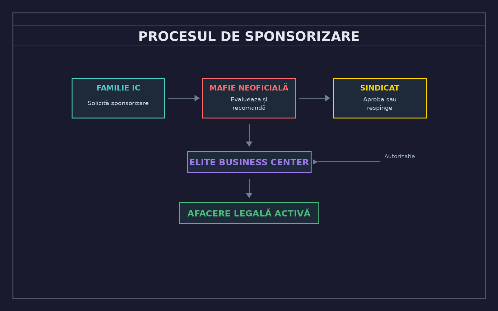

# 
FAMILIE IC - STADIUL I

<i>Primii pași în lumea criminală</i>

---

## Momentul zero - Nașterea

### Cerințe de înființare
- **Poveste de fundal** - de unde vin membrii, ce îi unește, care e scopul

::: info REGULAMENT
Cerințele obligatorii (număr de membri, lider, nume, ore jucate) se găsesc în **[Regulamentul Mafiilor](/zona-info/regulament-mafii)**, secțiunea 1.
:::

### Pașii concreți
1. Formați nucleul - găsiți 3-4 persoane de încredere absolută
2. Stabiliți identitatea - nume, culori orientative, stil
3. Recrutați până la 10+ membri activi
4. Faceți-vă remarcați în oraș prin activitate și roleplay de calitate
5. Dovediți-vă valoarea prin acțiuni, nu vorbe

::: danger PAS CRUCIAL
**Intrați în vizorul unei Mafii Neoficiale din zona voastră de activitate.** Fără atenția și recomandarea unei mafii neoficiale, familia voastră nu poate avansa. Aceasta este poarta către următorul nivel.
:::

---

## Perioada de probă și dovadă

În această fază, familia trebuie să **demonstreze** că merită atenția:

### Ce se evaluează
- **Activitatea** - prezența constantă și implicarea membrilor
- **Calitatea roleplay-ului** - scenarii complexe, nu doar acțiuni random
- **Disciplina** - respectarea regulamentului, lipsa sancțiunilor
- **Coeziunea** - membrii lucrează ca o echipă, nu ca indivizi
- **Reputația** - cum sunt percepuți de ceilalți jucători

### Monitorizarea de către mafiile neoficiale
Familiile IC sunt observate și evaluate de **Mafiile Neoficiale** de pe teritoriile lor. Acestea au responsabilitatea de a:
- Identifica familiile IC promițătoare
- Evalua potențialul și calitatea roleplay-ului
- Raporta Sindicatului despre progresul familiilor
- Recomanda sau nu avansarea la stadiul următor

---

## Afaceri legale ca paravan - Sistemul de sponsorizare

::: tip OPORTUNITATE DE EXPANSIUNE
O familie IC poate achiziționa o **afacere legală** prin **Elite Business Center** pentru a o folosi ca paravan în recrutarea viitorilor membri. Această facilitate nu este un drept, ci un **privilegiu obținut prin relații**.
:::

### Cum funcționează

O familie IC nu poate cumpăra singură o afacere legală - are nevoie de o recomandare din partea unei Mafii Neoficiale. Regulile complete se găsesc în **[Regulamentul Mafiilor](/zona-info/regulament-mafii)**, secțiunea 6.

### Cerințe pentru obținerea sponsorizării

| Cerință | Detalii |
|---------|---------|
| **Reputație** | Familia IC trebuie să aibă o imagine curată, fără scandaluri majore |
| **Activitate** | Prezență constantă și roleplay de calitate demonstrat |
| **Relație cu mafia sponsor** | Trebuie să fi colaborat anterior cu mafia neoficială |
| **Zonă de activitate** | Afacerea trebuie să fie pe un teritoriu al mafiei sponsor |
| **Plan de afaceri** | Trebuie prezentată o viziune clară a modului în care va fi folosită afacerea |

### Tipuri de afaceri potrivite ca paravan

- **Service auto** - recrutezi mecanici care "se dovedesc" a fi mai mult decât mecanici
- **Club/bar** - locul perfect pentru a cunoaște oameni și a-i evalua
- **Gunshop** - acces la arme și clienți cu interese similare
- **Benzinărie** - punct strategic, trafic constant, locație ideală pentru întâlniri
- **Magazin de haine** - fațadă elegantă, clienți variați, venituri stabile
- **Magazin** - flux constant de clienți potențiali
- **Spălătorie auto** - clasicul paravan, discret și profitabil

### Beneficiile sistemului

**Pentru familia IC:**
- **Sursă de venit legitimă** - bani curați care susțin operațiunile
- **Bază de recrutare** - angajații pot fi evaluați înainte de a fi abordați
- **Acoperire** - activitățile par legale din exterior
- **Reputație în oraș** - sunteți văzuți ca oameni de afaceri

**Pentru mafia neoficială (sponsor):**
- Mafia sponsor nu primește nicio taxă pentru recomandarea catre sindicat pentru preluarea unei afaceri - ea primește **loialitate** și **informații**
- **Influență extinsă** - mai multe afaceri sub umbrela lor în zonă
- **Loialitate** - familia IC le datorează acest privilegiu
- **Ochi și urechi** - informații despre ce se întâmplă în zonă
- **Rețea de contacte** - acces la potențiali recruți și aliați

### Obligații și pierderea privilegiului

Obligațiile familiei după obținerea afacerii și situațiile în care sponsorizarea poate fi retrasă se găsesc în **[Regulamentul Mafiilor](/zona-info/regulament-mafii)**, secțiunea 6.
