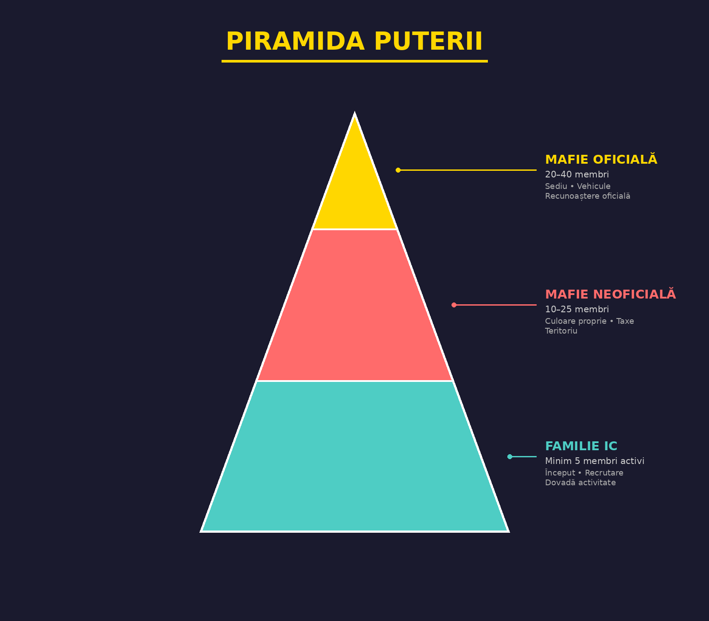

# 
VIAȚA ILEGALĂ - INTRODUCERE

<i>De la stradă la imperiu - Parcursul complet al unei organizații criminale</i>

---

## Introducere

Acest ghid reprezintă cartea de căpătâi pentru orice grup de jucători care doresc să construiască o familie IC de succes. Aici vei găsi regulile esențiale și mecanismele care guvernează lumea criminală, precum și pașii concreți pentru a evolua de la o simplă grupare de stradă până la o mafie oficială temută și respectată.

**Principiul fundamental:** *Roleplay-ul vine întotdeauna înaintea acțiunii. O poveste bine construită valorează mai mult decât o sută de victorii fără sens.*

---

## Anatomia unei organizații criminale

### Cele trei stadii ale evoluției

### Filosofia organizației

O familie IC nu este doar un grup de jucători care fac activități ilegale împreună. Este o **entitate vie** cu:

- **Identitate proprie** - nume, poveste, valori, cod de onoare
- **Ierarhie clară** - fiecare membru știe locul său și responsabilitățile
- **Obiective comune** - atât financiare cât și de influență
- **Loialitate absolută** - familia vine întotdeauna pe primul loc

---

## Cele trei stadii - Rezumat

| Stadiu | Membri | Descriere |
|--------|--------|-----------|
| **Familie IC** | Min 5 activi | Grupare de stradă care își dovedește valoarea |
| **Mafie Neoficială** | 10 - 25 | Organizație recunoscută cu teritorii și responsabilități |
| **Mafie Oficială** | 20 - 40 | Elita lumii criminale, cu influență maximă |

::: tip NAVIGARE
- **[Familie IC](./familie-ic)** - Cum să înființezi și să dezvolți o familie
- **[Mafie Neoficială & Oficială](./mafie-neoficiala)** - Tranziția și responsabilitățile
- **[Reguli & Operațiuni](./reguli-si-operatiuni)** - Codul familiei, sancțiuni, răpiri, Sindicat
:::
