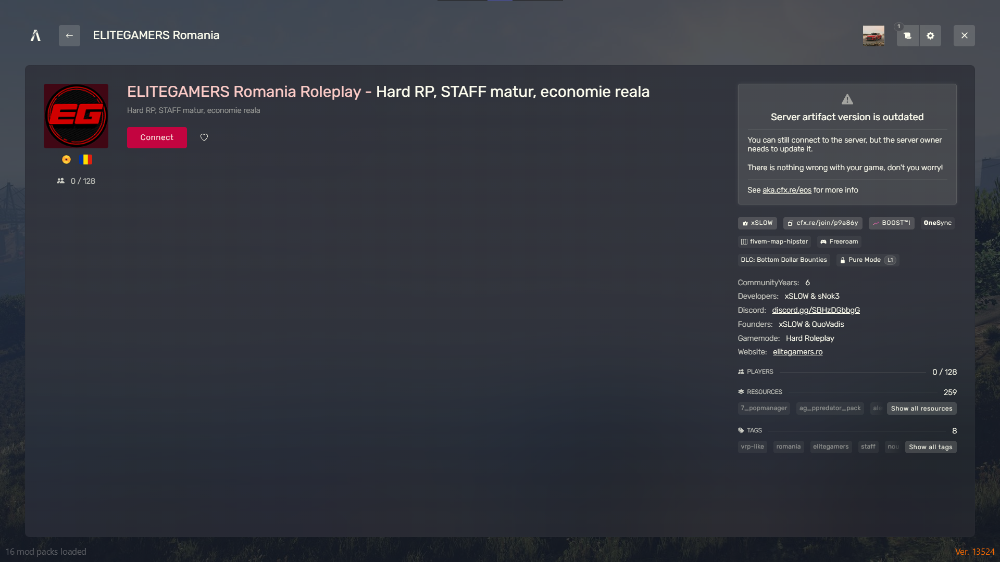

# 
Cum intru pe EliteGamers

### Pașii pentru a te conecta pe server-ul de FiveM ELITEGAMERS ROMANIA HARD ROLEPLAY:

### 1. Instalează FiveM

- Dacă nu ai deja FiveM, este necesar să-l descarci și să-l instalezi. FiveM este o aplicație terță parte care permite jucătorilor să se conecteze la serverele personalizate GTA V.
- Mergi la site-ul oficial FiveM și apasă pe „Download FiveM”.
- Urmează instrucțiunile de instalare pentru a-l configura pe PC-ul tău.
- Deschide FiveM
- După ce ai instalat aplicația, deschide FiveM și așteaptă să se încarce complet.

### 2. În aplicația FiveM, accesează meniul „Play” din partea de sus.

- În fereastra de căutare, scrie "ELITEGAMERS ROMANIA HARD ROLEPLAY".
- Apasă pe butonul de căutare și așteaptă ca serverul să apară în lista de servere disponibile.
- Selectează serverul și conectează-te
- Odată ce serverul FiveM ELITEGAMERS ROMANIA HARD ROLEPLAY apare în listă, apasă pe el pentru a-l selecta.
- Apasă butonul „Connect” pentru a începe procesul de conectare la server.

- Înainte de a începe să joci, asigură-te că citești regulile serverului ELITEGAMERS ROMANIA HARD ROLEPLAY. Acestea sunt esențiale pentru a te bucura de o experiență de roleplay plăcută și corectă alături de ceilalți jucători.

###  3. SOLUTIE IMPOTRIVA CRASH-URILOR

- Recomandarea noastră este de a vă șterge cache-ul Fivem înainte de a intra pe server pentru o funcționalitate corectă și curată a fișierelor.
- Pentru a șterge cache-ul jocului Fivem apăsăți clic dreapta pe iconița Fivem-ului și apăsați pe "Open File Location".
- În destinația folderului apăsăți dublu clic pe "FiveM Application Data" și navigați în folderul numit "data".
- În acest folder ștergeți următoarele fișiere: "cache", "server-cache" și "server-cache-priv".
- Acum puteți să va bucurați de un gameplay curat pe server.

###  4. OBLIGATORIU SA AVETI VERSIUNEA BETA

